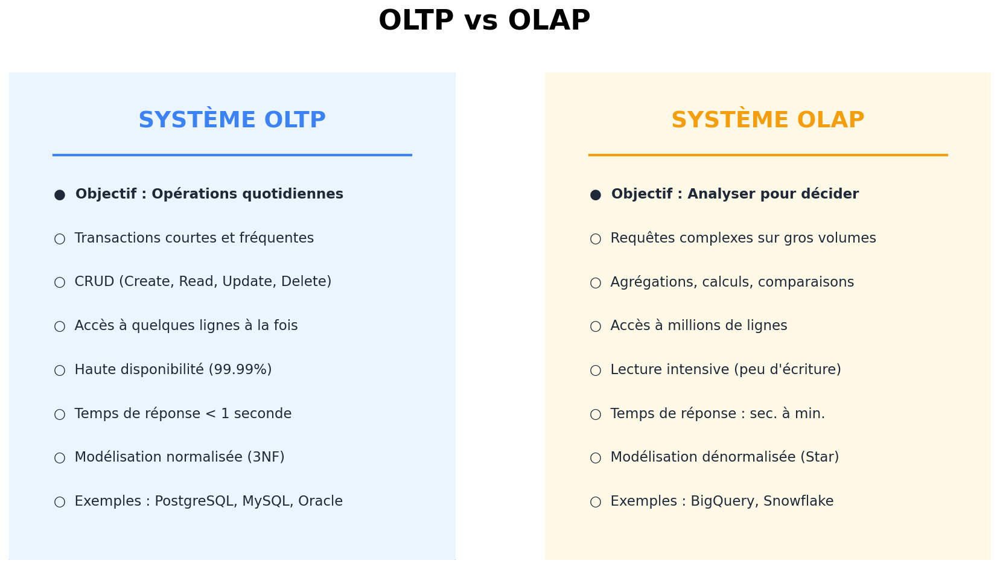
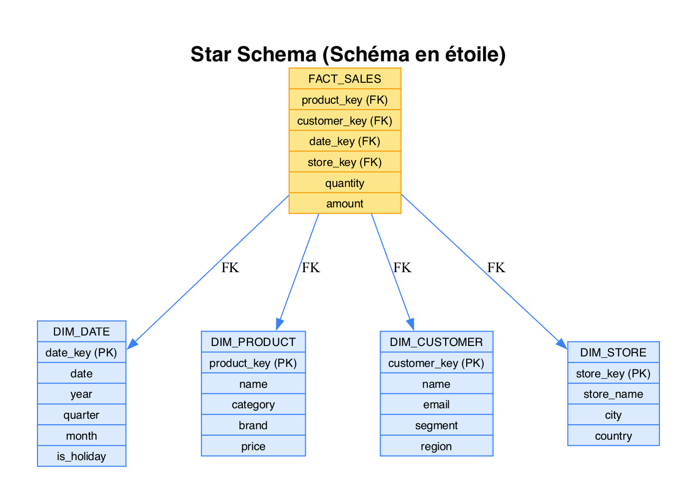
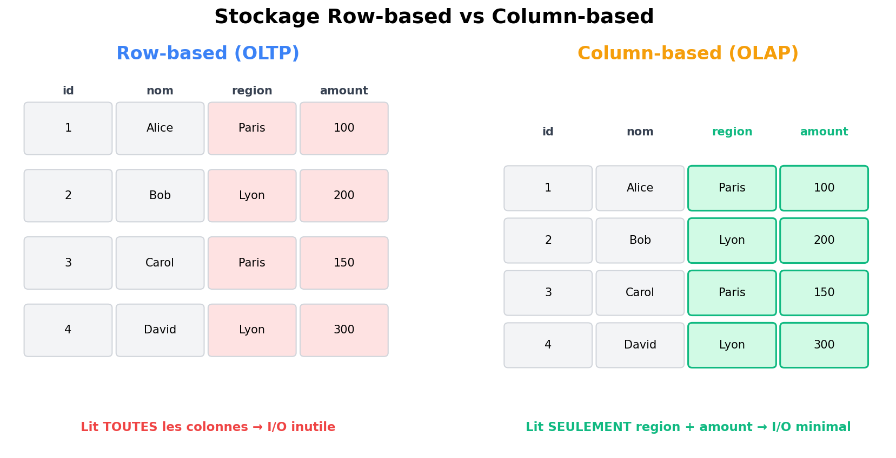

# Module 02 - OLTP vs OLAP

## Deux mondes, deux besoins

Les systèmes de données se divisent en deux grandes catégories selon leur usage :

| Type | Signification | Usage |
|------|---------------|-------|
| **OLTP** | Online Transaction Processing | Opérations quotidiennes |
| **OLAP** | Online Analytical Processing | Analyse et décision |

## OLTP - Systèmes transactionnels

### Caractéristiques



### Exemples de systèmes OLTP

- **ERP** : SAP, Oracle EBS, Microsoft Dynamics
- **CRM** : Salesforce, HubSpot
- **E-commerce** : Commandes, paiements, stocks
- **Banque** : Transactions, virements

### Requêtes typiques OLTP

```sql
-- Insertion d'une commande
INSERT INTO orders (customer_id, product_id, quantity, order_date)
VALUES (12345, 'PROD001', 2, CURRENT_TIMESTAMP);

-- Mise à jour du stock
UPDATE products
SET stock = stock - 2
WHERE product_id = 'PROD001';

-- Lecture d'un client
SELECT * FROM customers WHERE customer_id = 12345;
```

### Modélisation OLTP

**Normalisée (3NF)** pour éviter la redondance :

```
┌──────────────┐     ┌──────────────┐     ┌──────────────┐
│   CLIENTS    │     │   COMMANDES  │     │   PRODUITS   │
├──────────────┤     ├──────────────┤     ├──────────────┤
│ client_id PK │◄────│ client_id FK │     │ produit_id PK│
│ nom          │     │ commande_id  │────►│ nom          │
│ email        │     │ produit_id FK│     │ prix         │
│ adresse_id FK│     │ quantite     │     │ categorie_id │
└──────────────┘     └──────────────┘     └──────────────┘
```

## OLAP - Systèmes analytiques

### Caractéristiques

> Voir le diagramme comparatif OLTP vs OLAP ci-dessus.

### Exemples de systèmes OLAP

- **Data Warehouses** : Snowflake, BigQuery, Redshift
- **Cubes OLAP** : SQL Server Analysis Services
- **BI** : Power BI, Tableau, Looker

### Requêtes typiques OLAP

```sql
-- Chiffre d'affaires par région et trimestre
SELECT
    region,
    EXTRACT(QUARTER FROM order_date) as quarter,
    SUM(amount) as total_revenue,
    COUNT(*) as order_count,
    AVG(amount) as avg_order_value
FROM fact_sales
JOIN dim_customer USING (customer_key)
JOIN dim_date USING (date_key)
WHERE year = 2024
GROUP BY region, quarter
ORDER BY region, quarter;

-- Évolution des ventes vs année précédente
SELECT
    product_category,
    SUM(CASE WHEN year = 2024 THEN amount END) as sales_2024,
    SUM(CASE WHEN year = 2023 THEN amount END) as sales_2023,
    (SUM(CASE WHEN year = 2024 THEN amount END) -
     SUM(CASE WHEN year = 2023 THEN amount END)) /
     SUM(CASE WHEN year = 2023 THEN amount END) * 100 as growth_pct
FROM fact_sales
JOIN dim_product USING (product_key)
GROUP BY product_category;
```

### Modélisation OLAP

**Dénormalisée** pour la performance (Star Schema) :



## Comparaison détaillée

| Critère | OLTP | OLAP |
|---------|------|------|
| **Objectif** | Opérations | Analyse |
| **Utilisateurs** | Employés, applications | Analystes, décideurs |
| **Requêtes** | Simples, fréquentes | Complexes, ponctuelles |
| **Données** | Actuelles | Historiques |
| **Volume par requête** | Quelques lignes | Millions de lignes |
| **Temps de réponse** | Millisecondes | Secondes à minutes |
| **Modélisation** | Normalisée (3NF) | Dénormalisée (Star) |
| **Indexation** | B-tree, Hash | Colonnar, Bitmap |
| **Mise à jour** | Fréquente | Batch (ETL) |
| **Disponibilité** | 99.99% | 99.9% |

### HTAP : le meilleur des deux mondes ?

Les systèmes **HTAP** (Hybrid Transactional/Analytical Processing) promettent de combiner OLTP et OLAP dans un même moteur :

| Système | Approche |
|---------|----------|
| **TiDB** | Base distribuée compatible MySQL + analytique |
| **CockroachDB** | PostgreSQL-compatible avec capacités analytiques |
| **SingleStore** (ex-MemSQL) | In-memory, row + column store |
| **AlloyDB** (Google) | PostgreSQL managé avec moteur analytique |

> **En pratique :** HTAP reste émergent. La plupart des architectures production maintiennent la séparation OLTP + OLAP pour des raisons de performance et d'isolation. Mais la tendance est à la convergence.

## Stockage : Row vs Column



- **Row-based** : optimisé pour `SELECT * FROM clients WHERE id = 2`
- **Column-based** : optimisé pour `SELECT region, SUM(amount) FROM clients GROUP BY region`

### Avantages du stockage colonne

1. **Compression** : Valeurs similaires se compressent mieux
2. **Lecture sélective** : Ne lit que les colonnes nécessaires
3. **Vectorisation** : Opérations SIMD sur les colonnes
4. **Agrégations rapides** : SUM, AVG, COUNT optimisés

## Cas pratique : E-commerce

### Flux de données

```
                    OLTP                           OLAP
        ┌─────────────────────┐           ┌─────────────────────┐
        │  Site E-commerce    │           │   Data Warehouse    │
        ├─────────────────────┤           ├─────────────────────┤
Client ─►│ Création commande   │───ETL────►│ Analyse des ventes  │
        │ Paiement            │   (nuit)  │ Segmentation client │
        │ Mise à jour stock   │           │ Prédiction demande  │
        └─────────────────────┘           └─────────────────────┘
              │                                   │
              ▼                                   ▼
         MySQL/PostgreSQL                    BigQuery/Snowflake
```

### Exemple concret

**OLTP** (pendant la journée) :
```sql
-- Transaction en temps réel
BEGIN TRANSACTION;
INSERT INTO orders VALUES (...);
UPDATE inventory SET qty = qty - 1;
INSERT INTO payments VALUES (...);
COMMIT;
```

**OLAP** (pour le reporting) :
```sql
-- Analyse business
SELECT
    DATE_TRUNC('month', order_date) as month,
    product_category,
    SUM(revenue) as total_revenue,
    COUNT(DISTINCT customer_id) as unique_customers
FROM dwh.fact_orders
WHERE order_date >= '2024-01-01'
GROUP BY 1, 2
ORDER BY 1, 3 DESC;
```

## Points clés à retenir

- **OLTP** = transactions rapides, données actuelles, normalisées
- **OLAP** = analyses complexes, données historiques, dénormalisées
- Stockage colonnes = optimisé pour agrégations
- Le Data Warehouse est un système OLAP
- Les deux systèmes sont complémentaires
- **HTAP** = tendance émergente combinant OLTP + OLAP dans un même système

---

**Prochain module :** [03 - Modélisation dimensionnelle](./03-modelisation.md)

[Module précédent](./01-introduction.md) | [Retour au sommaire](./README.md)
