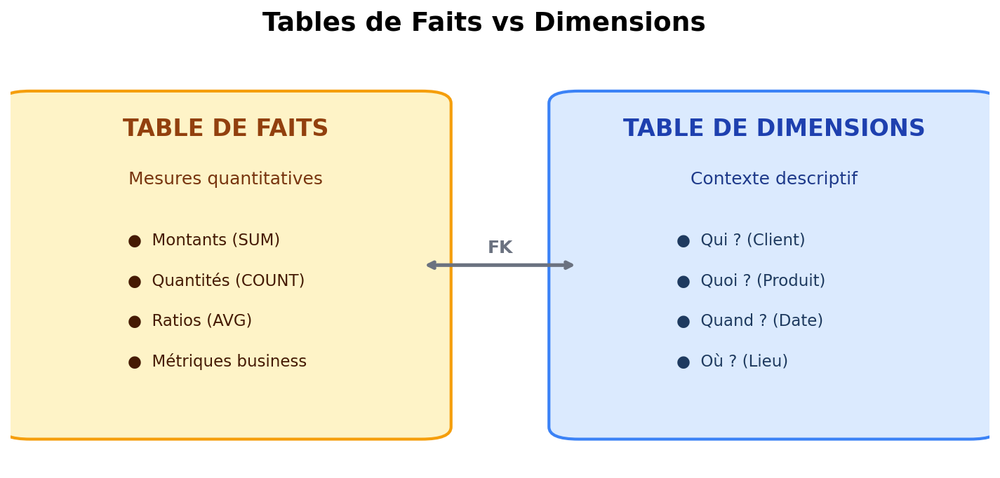
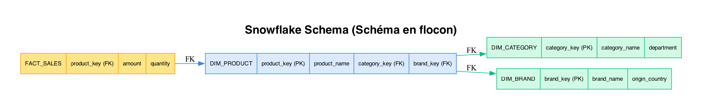
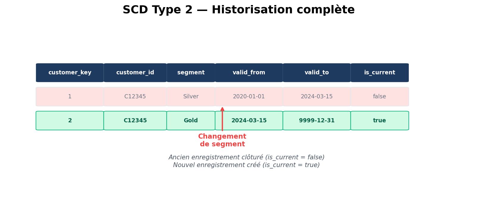

# Module 03 - Modélisation dimensionnelle

## Concepts fondamentaux

### Tables de faits (Fact Tables)

Les tables de faits contiennent les **mesures quantitatives** du business :
- Montants
- Quantités
- Comptages
- Ratios



### Types de mesures

| Type | Description | Exemple | Agrégation |
|------|-------------|---------|------------|
| **Additive** | Peut être sommée sur toutes dimensions | Revenue, Quantity | SUM() partout |
| **Semi-additive** | Sommable sur certaines dimensions | Solde compte | SUM() sauf temps |
| **Non-additive** | Ne peut pas être sommée | Prix unitaire, % | AVG(), dernière valeur |

### Tables de dimensions (Dimension Tables)

Les dimensions fournissent le **contexte descriptif** :
- Qui ? (Client)
- Quoi ? (Produit)
- Quand ? (Date)
- Où ? (Lieu)
- Comment ? (Canal)

```
┌────────────────────────────────────────┐
│           DIM_CUSTOMER                  │
├────────────────────────────────────────┤
│ customer_key     (PK, Surrogate)       │
│ customer_id      (Natural Key)         │
├────────────────────────────────────────┤
│ first_name                             │
│ last_name                              │
│ email                                  │
│ birth_date                             │
│ gender                                 │
│ segment          (Gold, Silver, Bronze)│
│ acquisition_date                       │
│ region                                 │
│ country                                │
└────────────────────────────────────────┘
```

### Clés surrogate vs naturelles

| Type | Description | Exemple |
|------|-------------|---------|
| **Natural Key** | Clé business originale | `customer_id = "C12345"` |
| **Surrogate Key** | Clé technique générée | `customer_key = 42` |

**Avantages des surrogate keys :**
- Performance (entiers)
- Indépendance du système source
- Gestion des SCD (historique)

## Schéma en étoile (Star Schema)

Le pattern le plus utilisé pour le Data Warehouse.


### Avantages du Star Schema

1. **Simple à comprendre** : Structure intuitive
2. **Performant** : Peu de jointures
3. **Optimisé pour BI** : Compatible tous outils
4. **Requêtes simples** : SQL lisible

### Requête typique Star Schema

```sql
SELECT
    d.year,
    d.quarter,
    p.category,
    c.segment,
    SUM(f.amount) as total_sales,
    COUNT(*) as transaction_count
FROM fact_sales f
JOIN dim_date d ON f.date_key = d.date_key
JOIN dim_product p ON f.product_key = p.product_key
JOIN dim_customer c ON f.customer_key = c.customer_key
WHERE d.year = 2024
GROUP BY d.year, d.quarter, p.category, c.segment
ORDER BY total_sales DESC;
```

## Schéma en flocon (Snowflake Schema)

Dimensions normalisées avec des sous-dimensions.



### Star vs Snowflake

| Aspect | Star | Snowflake |
|--------|------|-----------|
| **Complexité** | Simple | Plus complexe |
| **Performance** | Meilleure | Plus de JOINs |
| **Stockage** | Plus d'espace | Moins de redondance |
| **Maintenance** | Plus simple | Plus structuré |
| **Recommandé** | Général | Grandes dimensions |

## Slowly Changing Dimensions (SCD)

Comment gérer l'évolution des dimensions dans le temps ?

### SCD Type 1 - Écrasement

On écrase l'ancienne valeur. Pas d'historique.

```sql
-- Avant : segment = "Silver"
UPDATE dim_customer
SET segment = 'Gold'
WHERE customer_id = 'C12345';
-- Après : segment = "Gold" (Silver perdu)
```

**Usage :** Corrections d'erreurs, données non historisées.

### SCD Type 2 - Historisation

On crée une nouvelle ligne. Historique complet.



```sql
-- Clôturer l'ancien enregistrement
UPDATE dim_customer
SET valid_to = CURRENT_DATE - 1, is_current = false
WHERE customer_id = 'C12345' AND is_current = true;

-- Insérer le nouvel enregistrement
INSERT INTO dim_customer (customer_id, segment, valid_from, valid_to, is_current)
VALUES ('C12345', 'Gold', CURRENT_DATE, '9999-12-31', true);
```

**Usage :** Historique des changements requis.

### SCD Type 3 - Colonnes supplémentaires

On garde l'ancienne et la nouvelle valeur.

```
┌─────────────┬──────────────┬─────────────────┬─────────────────┐
│customer_key │ customer_id  │ current_segment │previous_segment │
├─────────────┼──────────────┼─────────────────┼─────────────────┤
│      1      │   C12345     │      Gold       │     Silver      │
└─────────────┴──────────────┴─────────────────┴─────────────────┘
```

**Usage :** Historique limité (avant/après uniquement).

### Comparaison SCD

| Type | Historique | Complexité | Stockage | Usage |
|------|------------|------------|----------|-------|
| **Type 1** | Non | Simple | Minimal | Corrections |
| **Type 2** | Complet | Complexe | Élevé | Audit, analyse temporelle |
| **Type 3** | Limité (N-1) | Moyen | Modéré | Comparaison avant/après |

## Dimension Date

La dimension incontournable. Pré-générée pour plusieurs années.

```sql
CREATE TABLE dim_date (
    date_key        INT PRIMARY KEY,      -- 20240215
    date            DATE NOT NULL,        -- 2024-02-15
    day             INT NOT NULL,         -- 15
    day_name        VARCHAR(10),          -- "Thursday"
    day_of_week     INT,                  -- 4
    day_of_year     INT,                  -- 46
    week_of_year    INT,                  -- 7
    month           INT,                  -- 2
    month_name      VARCHAR(10),          -- "February"
    quarter         INT,                  -- 1
    year            INT,                  -- 2024
    is_weekend      BOOLEAN,              -- false
    is_holiday      BOOLEAN,              -- false
    holiday_name    VARCHAR(50),          -- NULL
    fiscal_year     INT,                  -- 2024
    fiscal_quarter  INT                   -- 4
);
```

## Tables de faits sans mesure (Factless Fact Tables)

Certaines tables de faits ne contiennent **aucune mesure numérique** — elles capturent uniquement des **événements** ou des **associations** entre dimensions.

### Table d'événements

Enregistre qu'un événement s'est produit (présence, inscription, visite) :

```sql
-- Fait : présence d'un étudiant à un cours
CREATE TABLE fact_attendance (
    date_key        INT REFERENCES dim_date(date_key),
    student_key     INT REFERENCES dim_student(student_key),
    course_key      INT REFERENCES dim_course(course_key),
    classroom_key   INT REFERENCES dim_classroom(classroom_key)
    -- Pas de mesure ! La ligne elle-même EST l'information
);

-- Combien d'étudiants par cours ?
SELECT c.course_name, COUNT(*) as nb_students
FROM fact_attendance f
JOIN dim_course c ON f.course_key = c.course_key
GROUP BY c.course_name;
```

### Table de couverture (Coverage)

Capture les associations valides pour analyser ce qui **n'a pas** eu lieu :

```sql
-- Quels produits sont vendus dans quels magasins ?
CREATE TABLE fact_product_store_coverage (
    product_key   INT REFERENCES dim_product(product_key),
    store_key     INT REFERENCES dim_store(store_key),
    date_key      INT REFERENCES dim_date(date_key)
);

-- Quels produits n'ont PAS été vendus dans un magasin donné ?
SELECT p.product_name
FROM fact_product_store_coverage c
JOIN dim_product p ON c.product_key = p.product_key
LEFT JOIN fact_sales s
    ON c.product_key = s.product_key
    AND c.store_key = s.store_key
WHERE c.store_key = 42
  AND s.product_key IS NULL;
```

## Au-delà du dimensionnel : Data Vault (aperçu)

Le **Data Vault** est une méthodologie alternative à Kimball/Inmon, conçue pour les environnements agiles avec de nombreuses sources de données.

### Principes

| Composant | Rôle | Exemple |
|-----------|------|---------|
| **Hub** | Identifiant business unique | `hub_customer` (business key) |
| **Link** | Relation entre Hubs | `link_customer_order` |
| **Satellite** | Attributs descriptifs + historique | `sat_customer_details` (SCD automatique) |

### Quand considérer Data Vault ?

- **Nombreuses sources** de données à intégrer
- **Évolutions fréquentes** du modèle de données
- Besoin d'**auditabilité** complète
- Équipe data engineering expérimentée

### Data Vault vs Dimensionnel

| Critère | Dimensionnel (Kimball) | Data Vault |
|---------|----------------------|------------|
| **Objectif** | Performance requêtes BI | Intégration agile de données |
| **Complexité** | Modéré | Élevé |
| **Historisation** | SCD explicite | Automatique (Satellites) |
| **Évolutivité** | Schéma rigide | Très évolutif |
| **Utilisateurs** | Analystes, BI | Data Engineers |
| **Quand l'utiliser** | DW classique, BI | DW d'entreprise multi-sources |

> **En pratique :** Le dimensionnel (Star Schema) reste le standard pour les projets BI. Data Vault est utilisé en **couche intermédiaire** (entre les sources et le modèle dimensionnel final), notamment dans les architectures Medallion (Silver layer).

## Bonnes pratiques

### DO

- Utiliser des surrogate keys (entiers)
- Préférer le Star Schema au Snowflake
- Créer une dimension Date complète
- Documenter les transformations SCD
- Nommer clairement (dim_, fact_, _key, _id)

### DON'T

- Mettre des mesures dans les dimensions
- Créer des tables de faits sans dimensions
- Utiliser des clés composites complexes
- Négliger la qualité des données sources
- Ignorer les SCD (historique perdu)

## Points clés à retenir

- **Faits** = mesures quantitatives (SUM, COUNT, AVG)
- **Factless facts** = tables de faits sans mesure (événements, couverture)
- **Dimensions** = contexte descriptif (WHO, WHAT, WHERE, WHEN)
- **Star Schema** = simple, performant, recommandé
- **Snowflake** = dimensions normalisées, plus complexe
- **SCD** = gestion de l'évolution temporelle des dimensions
- **Data Vault** = méthodologie alternative pour l'intégration multi-sources (Hub/Link/Satellite)

---

**Prochain module :** [04 - Architectures et Patterns](./04-architectures.md)

[Module précédent](./02-oltp-vs-olap.md) | [Retour au sommaire](./README.md)
