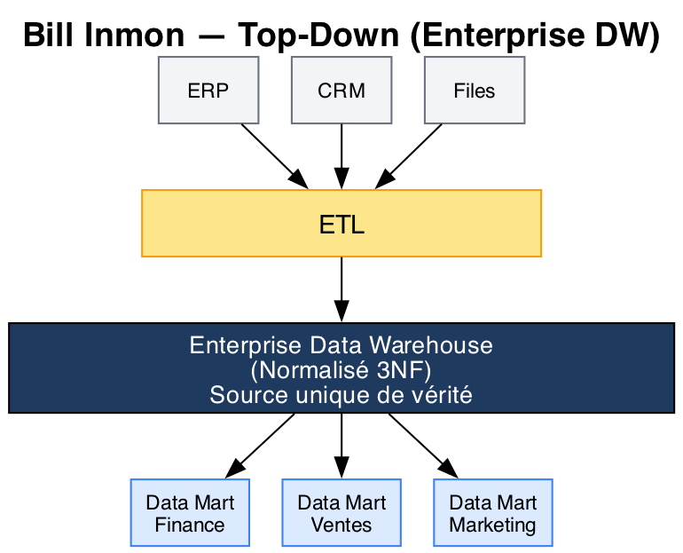
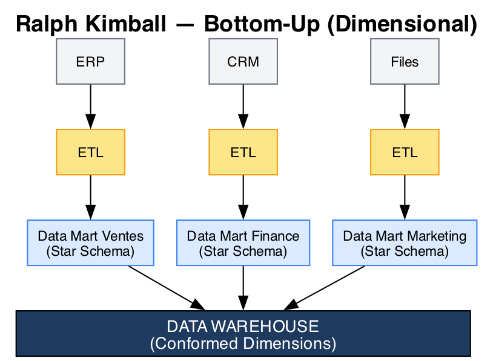
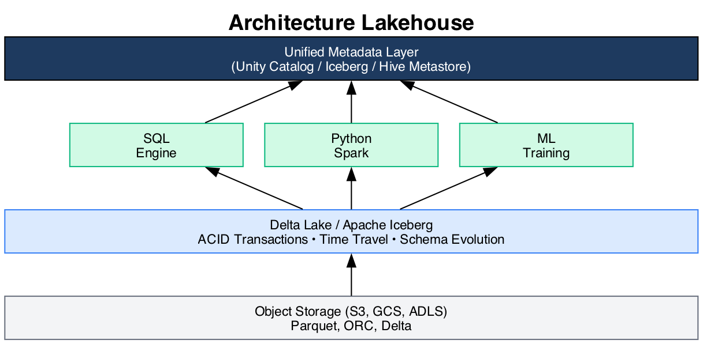
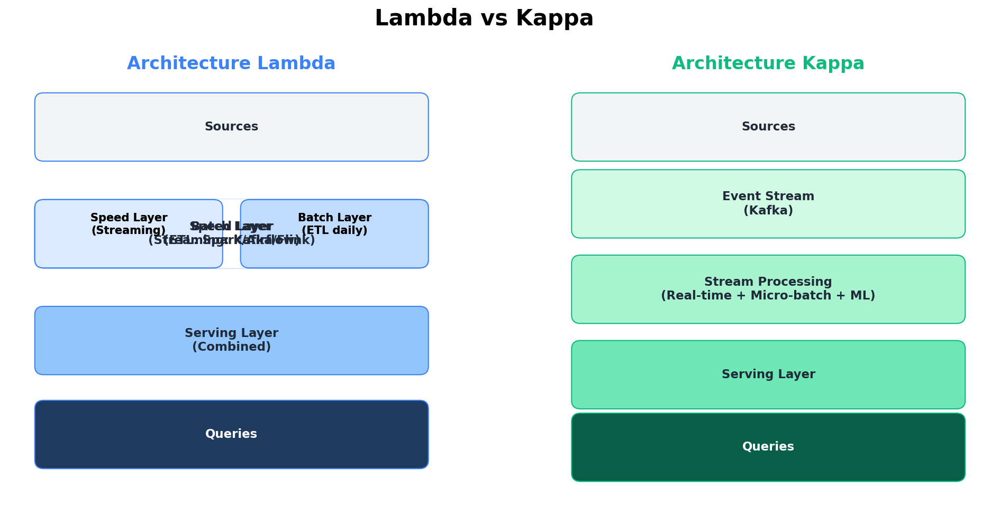

# Module 04 - Architectures et Patterns

## Les deux écoles fondatrices

### Bill Inmon - Top-Down (Enterprise DW)



**Caractéristiques :**
- DW centralisé et normalisé (3NF)
- Data Marts dépendants du DW
- Gouvernance forte
- Vision entreprise globale

**Avantages :**
- Cohérence des données garantie
- Une seule source de vérité
- Qualité des données élevée

**Inconvénients :**
- Long à mettre en place
- Coût initial élevé
- Rigidité du modèle

### Ralph Kimball - Bottom-Up (Dimensional)



**Caractéristiques :**
- Data Marts indépendants en Star Schema
- Dimensions conformes (partagées)
- Approche incrémentale
- Orienté business process

**Avantages :**
- Time-to-value rapide
- Coût initial modéré
- Flexibilité

**Inconvénients :**
- Risque de silos
- Cohérence à maintenir
- Dimensions à synchroniser

### Comparaison Inmon vs Kimball

| Aspect | Inmon | Kimball |
|--------|-------|---------|
| **Approche** | Top-down | Bottom-up |
| **Modèle central** | 3NF normalisé | Dimensional (Star) |
| **Data Marts** | Dépendants | Indépendants |
| **Délai initial** | Long | Court |
| **Coût initial** | Élevé | Modéré |
| **Évolutivité** | Complexe | Flexible |
| **Cas d'usage** | Grande entreprise | PME, agilité |

## Architecture moderne : Lakehouse

### Évolution des architectures

```
     2000s                2010s                2020s
┌─────────────┐      ┌─────────────┐      ┌─────────────┐
│    DW       │      │  DW + Lake  │      │  LAKEHOUSE  │
│ (Expensive) │      │  (Silos)    │      │  (Unified)  │
└─────────────┘      └─────────────┘      └─────────────┘
```

### Data Lakehouse

Le Lakehouse combine :
- **Stockage économique** du Data Lake (object storage)
- **Performance ACID** du Data Warehouse
- **Gouvernance** et qualité des données
- **Support ML** natif



### Implémentations Lakehouse

| Plateforme | Format de table | Métadonnées |
|------------|-----------------|-------------|
| **Databricks** | Delta Lake | Unity Catalog |
| **AWS** | Iceberg / Delta | Glue Catalog |
| **GCP** | BigLake | BigQuery |
| **Azure** | Delta Lake | Purview |
| **Snowflake** | Iceberg | Propriétaire |

## Architecture en couches (Layers)

### Architecture 3 couches classique

```
┌──────────────────────────────────────────────────────┐
│                  PRESENTATION                         │
│           (BI Tools, Dashboards, Reports)            │
└───────────────────────┬──────────────────────────────┘
                        │
┌───────────────────────▼──────────────────────────────┐
│                  DATA WAREHOUSE                       │
│               (Agrégations, KPIs)                    │
└───────────────────────┬──────────────────────────────┘
                        │
┌───────────────────────▼──────────────────────────────┐
│                   STAGING                             │
│           (Données brutes, nettoyage)                │
└───────────────────────┬──────────────────────────────┘
                        │
┌───────────────────────▼──────────────────────────────┐
│                    SOURCES                            │
│          (ERP, CRM, APIs, Files, ...)                │
└──────────────────────────────────────────────────────┘
```

### Architectures Lambda et Kappa



- **Lambda** : traitement temps réel (Speed Layer) + batch en parallèle, combinés dans une Serving Layer
- **Kappa** : simplification — tout est stream via un Event Stream (Kafka)

## Patterns de chargement

### Full Load (Rechargement complet)

```sql
-- Truncate + Insert
TRUNCATE TABLE dim_products;

INSERT INTO dim_products
SELECT * FROM staging.products;
```

**Quand l'utiliser :**
- Tables de référence petites
- Données source sans historique
- Reconstruction nécessaire

### Incremental Load (Chargement incrémental)

```sql
-- Merge / Upsert
MERGE INTO dim_products target
USING staging.products source
ON target.product_id = source.product_id
WHEN MATCHED THEN UPDATE SET ...
WHEN NOT MATCHED THEN INSERT ...;
```

**Quand l'utiliser :**
- Tables volumineuses
- Changements fréquents
- Performance critique

### Change Data Capture (CDC)

Capture les changements en temps réel depuis la source.

```
┌────────────┐    ┌─────────┐    ┌────────────┐
│   Source   │───►│   CDC   │───►│  Target    │
│    DB      │    │ (Debezium)   │    DW      │
└────────────┘    └─────────┘    └────────────┘
```

**Outils CDC :**
- Debezium
- Oracle GoldenGate
- AWS DMS
- Airbyte

## Streaming et temps réel

### Pourquoi le temps réel ?

Les architectures batch (ETL nocturne) ne suffisent plus pour certains cas d'usage :

| Cas d'usage | Latence acceptable | Approche |
|-------------|-------------------|----------|
| Dashboard mensuel | Heures | Batch (ETL classique) |
| Détection de fraude | Secondes | Streaming |
| Recommandation produit | Minutes | Near real-time |
| Monitoring IoT | Millisecondes | Streaming |
| Reporting opérationnel | Minutes | Micro-batch |

### Apache Kafka : la colonne vertébrale du streaming

```
PRODUCTEURS                    KAFKA CLUSTER                  CONSOMMATEURS
┌──────────┐              ┌─────────────────────┐            ┌──────────┐
│   App    │──────┐       │  Topic: orders       │     ┌─────│ BigQuery │
│  Web     │      │       │  ┌─────┬─────┬─────┐ │     │     └──────────┘
└──────────┘      ├──────►│  │ P0  │ P1  │ P2  │ │─────┤
┌──────────┐      │       │  └─────┴─────┴─────┘ │     │     ┌──────────┐
│   IoT    │──────┤       │                       │     ├─────│ Spark    │
│ Sensors  │      │       │  Topic: clickstream   │     │     │Streaming │
└──────────┘      │       │  ┌─────┬─────┬─────┐ │     │     └──────────┘
┌──────────┐      │       │  │ P0  │ P1  │ P2  │ │─────┤
│  Mobile  │──────┘       │  └─────┴─────┴─────┘ │     │     ┌──────────┐
│   App    │              └─────────────────────┘      └─────│ Alert    │
└──────────┘                                                  │ System   │
                                                              └──────────┘
```

### Pipeline streaming vers DW

```sql
-- Exemple : ingestion streaming BigQuery
-- Via l'API Storage Write (recommandé en production)
-- ou via Pub/Sub + Dataflow

-- Table partitionnée pour recevoir le stream
CREATE TABLE bronze.events_stream (
    event_id STRING,
    event_type STRING,
    payload STRING,  -- JSON
    event_timestamp TIMESTAMP
)
PARTITION BY DATE(event_timestamp)
OPTIONS(
    require_partition_filter = true  -- Sécurité coût
);
```

### Outils de streaming par écosystème

| Outil | Écosystème | Modèle |
|-------|-----------|--------|
| **Apache Kafka** | Multi-cloud | Event streaming distribué |
| **Apache Flink** | Multi-cloud | Stream processing (stateful) |
| **Spark Structured Streaming** | Databricks, multi | Micro-batch / streaming |
| **Google Pub/Sub + Dataflow** | GCP | Serverless streaming |
| **Amazon Kinesis** | AWS | Managed streaming |
| **Azure Event Hubs** | Azure | Managed streaming |

## Data Mesh (aperçu)

### Le problème du DW centralisé

À grande échelle, l'équipe data centrale devient un **goulot d'étranglement** :

```
        TOUTES LES ÉQUIPES
           │ │ │ │ │
           ▼ ▼ ▼ ▼ ▼
      ┌─────────────────┐
      │  Équipe Data    │  ← Goulot d'étranglement
      │  Centrale       │     (backlog énorme)
      └────────┬────────┘
               ▼
        ┌─────────────┐
        │  DW Central  │
        └─────────────┘
```

### Principes du Data Mesh

Le **Data Mesh** (Zhamak Dehghani, 2019) propose 4 principes :

| Principe | Description |
|----------|-------------|
| **Domain ownership** | Chaque domaine métier est responsable de ses données |
| **Data as a product** | Les données exposées doivent être fiables, documentées, découvrables |
| **Self-serve platform** | Infrastructure en libre-service pour les domaines |
| **Federated governance** | Gouvernance partagée avec des standards communs |

```
┌──────────────────────────────────────────────────────────────┐
│                     DATA MESH                                 │
│                                                               │
│  ┌─────────────┐  ┌─────────────┐  ┌─────────────┐          │
│  │  Domaine    │  │  Domaine    │  │  Domaine    │          │
│  │  Ventes     │  │  Marketing  │  │  Logistique │          │
│  │             │  │             │  │             │          │
│  │ Data Product│  │ Data Product│  │ Data Product│          │
│  │ "Orders"   │  │ "Campaigns" │  │ "Shipments" │          │
│  └──────┬──────┘  └──────┬──────┘  └──────┬──────┘          │
│         │                │                │                   │
│         └────────────────┼────────────────┘                   │
│                          ▼                                    │
│              ┌───────────────────────┐                        │
│              │   Self-Serve Platform │                        │
│              │   (Infra commune)     │                        │
│              └───────────────────────┘                        │
└──────────────────────────────────────────────────────────────┘
```

### Data Mesh vs DW Centralisé

| Critère | DW Centralisé | Data Mesh |
|---------|--------------|-----------|
| **Responsabilité** | Équipe data | Domaines métier |
| **Scalabilité organisationnelle** | Limitée | Haute |
| **Time-to-value** | Lent (backlog central) | Rapide (autonomie) |
| **Complexité technique** | Modérée | Élevée |
| **Gouvernance** | Centralisée | Fédérée |
| **Adapté pour** | PME, cas simples | Grandes organisations, +50 data sources |

> **En pratique :** Data Mesh est un modèle **organisationnel**, pas une technologie. Il se combine avec les architectures techniques vues précédemment (Lakehouse, Medallion). La plupart des entreprises adoptent un **hybride** entre centralisation et décentralisation.

## Points clés à retenir

- **Inmon** : DW centralisé normalisé, puis Data Marts
- **Kimball** : Data Marts dimensionnels, puis consolidation
- **Lakehouse** : Fusion DW + Data Lake avec ACID
- **Lambda** : Batch + Real-time en parallèle
- **Kappa** : Tout en streaming
- **CDC** : Capture des changements temps réel
- **Kafka** : Standard de fait pour le streaming de données
- **Data Mesh** : Décentralisation des responsabilités data par domaine métier

---

**Prochain module :** [05 - Opérations OLAP & Approches d'implantation](./05-operations-olap.md)

[Module précédent](./03-modelisation.md) | [Retour au sommaire](./README.md)
