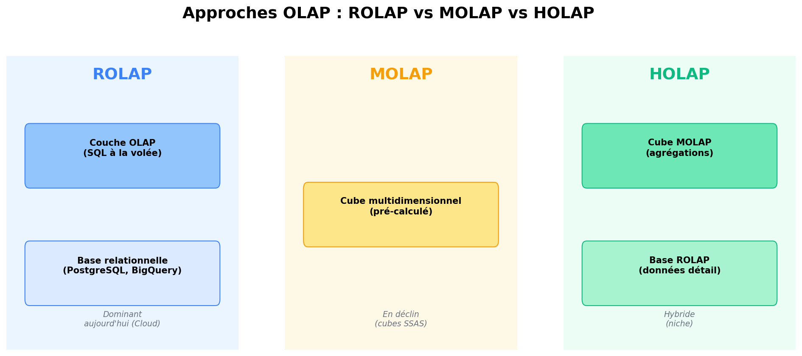
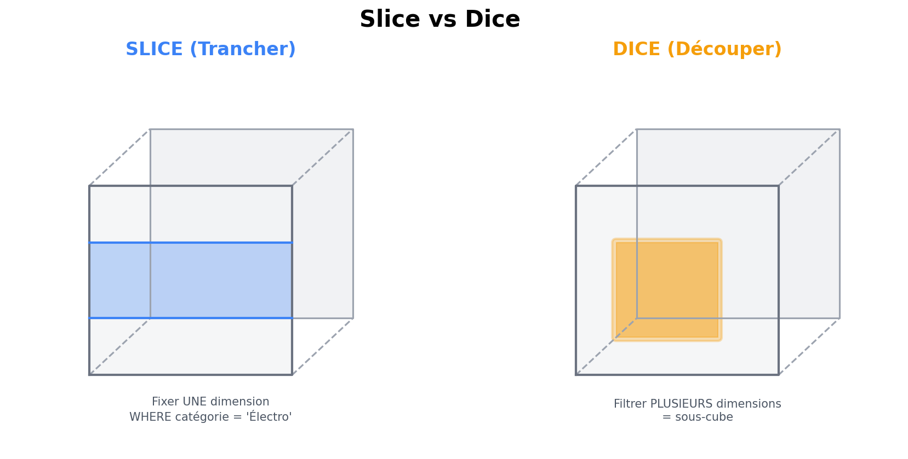
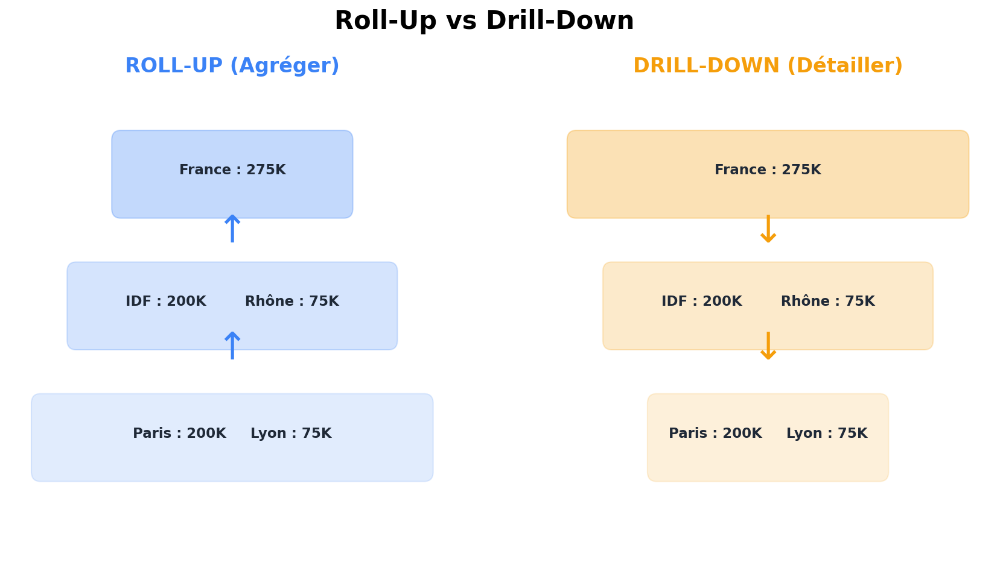

# Module 05 - Opérations OLAP & Approches d'implantation

## Approches d'implantation OLAP

Il existe trois grandes approches pour implémenter un système OLAP, selon la façon dont les données sont stockées et les calculs effectués.

### ROLAP (Relational OLAP)

Les données restent dans une **base relationnelle** classique. Le moteur OLAP traduit les requêtes multidimensionnelles en SQL.



**Avantages :**
- Scalabilité sur de très gros volumes
- Pas besoin de pré-calculer les agrégations
- Utilise les technologies relationnelles existantes
- Flexibilité pour ajouter de nouvelles dimensions

**Inconvénients :**
- Performances moindres sur les requêtes complexes
- Temps de réponse variable selon la complexité
- Dépend de l'optimiseur SQL

**Exemples :** BigQuery, Snowflake, Redshift, PostgreSQL avec Star Schema

### MOLAP (Multidimensional OLAP)

Les données sont stockées dans un **cube multidimensionnel** pré-calculé. Les agrégations sont matérialisées à l'avance.

> Voir le diagramme comparatif ROLAP / MOLAP / HOLAP ci-dessus.

**Avantages :**
- Performances excellentes (données pré-agrégées)
- Temps de réponse constant et très rapide
- Idéal pour les tableaux de bord interactifs

**Inconvénients :**
- Temps de construction du cube long
- Explosion combinatoire (nb dimensions x nb membres)
- Stockage important
- Moins flexible pour les requêtes ad-hoc

**Exemples :** SQL Server Analysis Services (SSAS), Oracle Essbase, IBM Cognos TM1

### HOLAP (Hybrid OLAP)

Combine ROLAP et MOLAP : les **agrégations fréquentes sont pré-calculées** (MOLAP), le **détail reste en relationnel** (ROLAP).

> Voir le diagramme comparatif ROLAP / MOLAP / HOLAP ci-dessus.

**Avantages :**
- Compromis performance / flexibilité
- Agrégations rapides + détail accessible
- Stockage maîtrisé

**Inconvénients :**
- Complexité de gestion (deux systèmes)
- Latence lors du passage MOLAP → ROLAP (drill-down)

**Exemples :** SQL Server Analysis Services (mode HOLAP), Oracle OLAP

### Comparaison des approches

| Critère | ROLAP | MOLAP | HOLAP |
|---------|-------|-------|-------|
| **Stockage** | Relationnel (SQL) | Cube multidimensionnel | Hybride |
| **Performances** | Variables | Excellentes | Bonnes |
| **Volume de données** | Très grand | Limité | Grand |
| **Temps de réponse** | Secondes à minutes | Millisecondes | Millisecondes (agrégé) |
| **Flexibilité** | Haute | Faible | Moyenne |
| **Pré-calcul** | Non | Oui (tout) | Oui (agrégations) |
| **Coût stockage** | Faible | Élevé | Moyen |
| **Tendance actuelle** | Dominant (cloud) | En déclin | Niche |

### Tendance du marché

```
  2000s              2010s              2020s
  MOLAP dominant     HOLAP monte        ROLAP domine
  (cubes SSAS,       (hybride)          (BigQuery, Snowflake
   Essbase)                              Redshift, Databricks)

  Raison : le cloud a rendu le calcul à la volée
  suffisamment rapide pour remplacer les cubes.
```

Aujourd'hui, l'approche **ROLAP domine** grâce aux Data Warehouses cloud (BigQuery, Snowflake, Redshift) capables d'exécuter des agrégations sur des milliards de lignes en quelques secondes. Les cubes MOLAP restent utilisés dans certains environnements Microsoft (SSAS) et pour des cas nécessitant des temps de réponse sub-seconde.

---

## Opérations OLAP

Les opérations OLAP permettent de naviguer dans les données multidimensionnelles. On manipule un **cube** composé de dimensions (axes) et de mesures (valeurs).

### Le cube OLAP conceptuel



### Données d'exemple

Pour illustrer les opérations, on utilise cette table de faits :

```
┌──────────┬───────────┬──────────┬──────────┬──────────┬──────────┐
│ Année    │ Trimestre │ Région   │ Ville    │ Catégorie│   CA     │
├──────────┼───────────┼──────────┼──────────┼──────────┼──────────┤
│ 2024     │ T1        │ IDF      │ Paris    │ Électro  │ 120 000  │
│ 2024     │ T1        │ IDF      │ Paris    │ Vêtements│  80 000  │
│ 2024     │ T1        │ Rhône    │ Lyon     │ Électro  │  45 000  │
│ 2024     │ T1        │ Rhône    │ Lyon     │ Vêtements│  30 000  │
│ 2024     │ T2        │ IDF      │ Paris    │ Électro  │ 150 000  │
│ 2024     │ T2        │ IDF      │ Paris    │ Vêtements│  95 000  │
│ 2024     │ T2        │ Rhône    │ Lyon     │ Électro  │  55 000  │
│ 2024     │ T2        │ Rhône    │ Lyon     │ Vêtements│  35 000  │
│ 2023     │ T1        │ IDF      │ Paris    │ Électro  │ 100 000  │
│ 2023     │ T1        │ Rhône    │ Lyon     │ Électro  │  40 000  │
└──────────┴───────────┴──────────┴──────────┴──────────┴──────────┘
```

---

### 1. Slice (Trancher)

Sélectionner une **tranche** du cube en fixant une dimension à une valeur.

> Voir le diagramme Slice vs Dice ci-dessus.

```sql
-- Slice : on fixe la catégorie
SELECT
    trimestre,
    region,
    SUM(ca) as chiffre_affaires
FROM fact_ventes
WHERE categorie = 'Électro'     -- ← SLICE sur Électro
  AND annee = 2024
GROUP BY trimestre, region;
```

| Trimestre | Région | CA |
|-----------|--------|----|
| T1 | IDF | 120 000 |
| T1 | Rhône | 45 000 |
| T2 | IDF | 150 000 |
| T2 | Rhône | 55 000 |

---

### 2. Dice (Découper)

Sélectionner un **sous-cube** en filtrant sur plusieurs dimensions simultanément.

> Voir le diagramme Slice vs Dice ci-dessus.

```sql
-- Dice : on filtre sur plusieurs dimensions
SELECT
    trimestre,
    categorie,
    SUM(ca) as chiffre_affaires
FROM fact_ventes
WHERE annee = 2024
  AND categorie IN ('Électro')        -- ← filtre dimension 1
  AND trimestre IN ('T1', 'T2')       -- ← filtre dimension 2
  AND region = 'IDF'                  -- ← filtre dimension 3
GROUP BY trimestre, categorie;
```

---

### 3. Roll-Up (Agréger / Remonter)

**Remonter** dans la hiérarchie d'une dimension pour obtenir une vue plus agrégée.



```sql
-- Niveau détaillé : CA par ville et trimestre
SELECT ville, trimestre, SUM(ca) FROM fact_ventes
WHERE annee = 2024
GROUP BY ville, trimestre;

-- Roll-up sur Lieu : Ville → Région
SELECT region, trimestre, SUM(ca) FROM fact_ventes
WHERE annee = 2024
GROUP BY region, trimestre;

-- Roll-up sur Temps : Trimestre → Année
SELECT region, annee, SUM(ca) FROM fact_ventes
GROUP BY region, annee;

-- Roll-up complet avec ROLLUP SQL
SELECT
    COALESCE(region, 'TOTAL') as region,
    COALESCE(trimestre, 'TOTAL') as trimestre,
    SUM(ca) as chiffre_affaires
FROM fact_ventes
WHERE annee = 2024
GROUP BY ROLLUP(region, trimestre);
```

Résultat du `ROLLUP` :

| Région | Trimestre | CA |
|--------|-----------|------|
| IDF | T1 | 200 000 |
| IDF | T2 | 245 000 |
| IDF | TOTAL | 445 000 |
| Rhône | T1 | 75 000 |
| Rhône | T2 | 90 000 |
| Rhône | TOTAL | 165 000 |
| TOTAL | TOTAL | 610 000 |

---

### 4. Drill-Down (Détailler / Descendre)

**Descendre** dans la hiérarchie pour obtenir plus de détail. C'est l'inverse du Roll-Up.

> Voir le diagramme Roll-Up vs Drill-Down ci-dessus.

```sql
-- Vue agrégée : CA par année
SELECT annee, SUM(ca) FROM fact_ventes
GROUP BY annee;

-- Drill-down : CA par trimestre pour 2024
SELECT annee, trimestre, SUM(ca) FROM fact_ventes
WHERE annee = 2024
GROUP BY annee, trimestre;

-- Drill-down encore : CA par mois (si la donnée existe)
SELECT annee, trimestre, mois, SUM(ca) FROM fact_ventes
WHERE annee = 2024
GROUP BY annee, trimestre, mois;
```

---

### 5. Pivot (Rotation)

**Faire pivoter** les axes du cube pour changer la perspective d'analyse. On intervertit les dimensions en lignes et colonnes.

```
  Avant pivot :                      Après pivot :
  Lignes = Régions                   Lignes = Catégories
  Colonnes = Catégories              Colonnes = Régions

  ┌────────┬──────────┬───────────┐  ┌───────────┬─────────┬────────┐
  │        │ Électro  │ Vêtements │  │           │   IDF   │ Rhône  │
  ├────────┼──────────┼───────────┤  ├───────────┼─────────┼────────┤
  │ IDF    │  270K    │   175K    │  │ Électro   │  270K   │ 100K   │
  │ Rhône  │  100K    │    65K    │  │ Vêtements │  175K   │  65K   │
  └────────┴──────────┴───────────┘  └───────────┴─────────┴────────┘
```

```sql
-- Pivot : afficher les régions en colonnes
SELECT
    categorie,
    SUM(CASE WHEN region = 'IDF' THEN ca ELSE 0 END) as idf,
    SUM(CASE WHEN region = 'Rhône' THEN ca ELSE 0 END) as rhone
FROM fact_ventes
WHERE annee = 2024
GROUP BY categorie;

-- En PostgreSQL, on peut aussi utiliser tablefunc / crosstab
-- (voir TP SQL OLAP PostgreSQL)
```

---

### 6. Drill-Through (Accès au détail)

Accéder aux **lignes de détail** sous-jacentes d'une cellule agrégée.

```sql
-- Vue agrégée : CA Électro IDF T1 = 120 000€
-- Drill-through : quelles sont les transactions ?
SELECT
    date_vente,
    client,
    produit,
    montant
FROM fact_ventes_detail
WHERE categorie = 'Électro'
  AND region = 'IDF'
  AND trimestre = 'T1'
  AND annee = 2024
ORDER BY montant DESC;
```

---

### Résumé des opérations

| Opération | Action | Exemple |
|-----------|--------|---------|
| **Slice** | Fixer 1 dimension | WHERE catégorie = 'Électro' |
| **Dice** | Filtrer N dimensions | WHERE catégorie IN (...) AND trimestre IN (...) |
| **Roll-Up** | Agréger (monter dans la hiérarchie) | Ville → Région, Mois → Trimestre |
| **Drill-Down** | Détailler (descendre dans la hiérarchie) | Année → Trimestre → Mois |
| **Pivot** | Intervertir axes lignes/colonnes | Régions en lignes ↔ en colonnes |
| **Drill-Through** | Voir les lignes de détail | Transaction individuelle |

---

### Fonctions SQL pour les opérations OLAP

PostgreSQL et les DW cloud fournissent des fonctions SQL dédiées :

```sql
-- ROLLUP : sous-totaux hiérarchiques
SELECT region, categorie, SUM(ca)
FROM fact_ventes
GROUP BY ROLLUP(region, categorie);

-- CUBE : toutes les combinaisons possibles
SELECT region, categorie, SUM(ca)
FROM fact_ventes
GROUP BY CUBE(region, categorie);

-- GROUPING SETS : combinaisons spécifiques
SELECT region, categorie, trimestre, SUM(ca)
FROM fact_ventes
GROUP BY GROUPING SETS (
    (region, categorie),        -- CA par région et catégorie
    (region, trimestre),        -- CA par région et trimestre
    (categorie),                -- CA par catégorie uniquement
    ()                          -- Total général
);

-- GROUPING() : identifier les lignes de sous-total
SELECT
    CASE WHEN GROUPING(region) = 1 THEN 'TOUTES' ELSE region END as region,
    CASE WHEN GROUPING(categorie) = 1 THEN 'TOUTES' ELSE categorie END as categorie,
    SUM(ca) as chiffre_affaires
FROM fact_ventes
GROUP BY CUBE(region, categorie);
```

## Points clés à retenir

- **ROLAP** = données relationnelles, SQL à la volée → dominant aujourd'hui (cloud)
- **MOLAP** = cubes pré-calculés, ultra-rapide → en déclin
- **HOLAP** = hybride agrégations + détail → usage niche
- **Slice** = fixer une dimension, **Dice** = filtrer plusieurs dimensions
- **Roll-Up** = agréger (monter), **Drill-Down** = détailler (descendre)
- **Pivot** = intervertir lignes/colonnes
- SQL fournit `ROLLUP`, `CUBE`, `GROUPING SETS` pour les opérations OLAP

---

**Prochain module :** [06 - Technologies Cloud](./06-technologies-cloud.md)

[Module précédent](./04-architectures.md) | [Retour au sommaire](./README.md)
