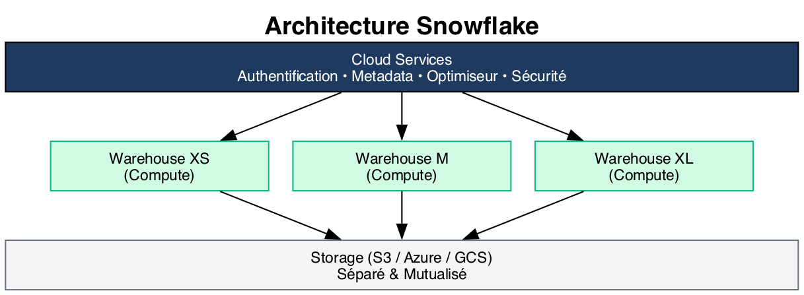
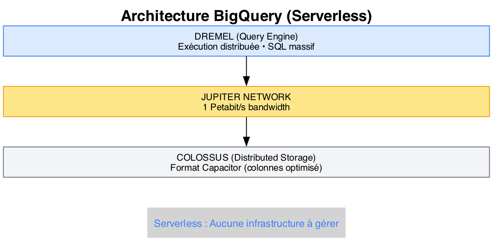

# Module 06 - Technologies Cloud Data Warehouse

## Vue d'ensemble du marché

Les Data Warehouses cloud ont révolutionné l'analytique en offrant :
- Scalabilité élastique
- Paiement à l'usage
- Zéro infrastructure à gérer
- Performance optimisée

### Les leaders du marché

```
┌─────────────────────────────────────────────────────────┐
│                 CLOUD DATA WAREHOUSES                    │
├─────────────────────────────────────────────────────────┤
│                                                          │
│  ┌────────────┐  ┌────────────┐  ┌────────────┐         │
│  │ Snowflake  │  │ BigQuery   │  │  Redshift  │         │
│  │   (Multi)  │  │   (GCP)    │  │   (AWS)    │         │
│  └────────────┘  └────────────┘  └────────────┘         │
│                                                          │
│  ┌────────────┐  ┌────────────┐  ┌────────────┐         │
│  │  Synapse   │  │ Databricks │  │  Firebolt  │         │
│  │  (Azure)   │  │   (Multi)  │  │   (Multi)  │         │
│  └────────────┘  └────────────┘  └────────────┘         │
│                                                          │
└─────────────────────────────────────────────────────────┘
```

## Snowflake

### Architecture unique



### Caractéristiques clés

| Fonctionnalité | Description |
|----------------|-------------|
| **Multi-cloud** | AWS, Azure, GCP |
| **Separation of concerns** | Compute et Storage indépendants |
| **Zero-copy cloning** | Clone instantané sans duplication |
| **Time Travel** | Accès aux données passées (jusqu'à 90j) |
| **Data Sharing** | Partage sans copie entre comptes |
| **Semi-structured** | JSON, Avro, Parquet natifs |

### Tarification

```
Coût Total = Compute (Credits) + Storage (TB/mois)
                │                      │
                ▼                      ▼
         Usage réel              $23-40/TB/mois
         (par seconde)           selon région
```

### Exemple SQL Snowflake

```sql
-- Créer un warehouse
CREATE WAREHOUSE analytics_wh
WITH WAREHOUSE_SIZE = 'MEDIUM'
AUTO_SUSPEND = 60
AUTO_RESUME = TRUE;

-- Time Travel
SELECT * FROM sales
AT(TIMESTAMP => '2024-01-15 10:00:00'::TIMESTAMP);

-- Clone sans copie
CREATE TABLE sales_backup CLONE sales;
```

## Google BigQuery

### Architecture serverless



### Caractéristiques clés

| Fonctionnalité | Description |
|----------------|-------------|
| **Serverless** | Aucune infrastructure à gérer |
| **Auto-scaling** | Scaling automatique illimité |
| **SQL Standard** | SQL ANSI-2011 |
| **BigQuery ML** | ML directement en SQL |
| **Streaming** | Ingestion temps réel |
| **GIS** | Données géospatiales natives |
| **BI Engine** | Cache en mémoire pour BI |

### Tarification

```
┌─────────────────────────────────────────────────────────┐
│                 MODÈLES DE TARIFICATION                  │
├─────────────────────────────────────────────────────────┤
│                                                          │
│  ON-DEMAND (À la requête)                               │
│  ├── $5 / TB de données scannées                        │
│  ├── 1 TB gratuit / mois                                │
│  └── Idéal pour charges variables                       │
│                                                          │
│  CAPACITY (Réservation)                                 │
│  ├── Slots réservés (unités de calcul)                  │
│  ├── Prix prévisible                                    │
│  └── Idéal pour charges constantes                      │
│                                                          │
│  STORAGE                                                │
│  ├── $0.02 / GB / mois (Active)                         │
│  └── $0.01 / GB / mois (Long-term, > 90 jours)          │
│                                                          │
└─────────────────────────────────────────────────────────┘
```

### Exemple SQL BigQuery

```sql
-- Requête simple avec coût contrôlé
SELECT
    region,
    DATE_TRUNC(order_date, MONTH) as month,
    SUM(amount) as revenue
FROM `project.dataset.orders`
WHERE order_date >= '2024-01-01'
GROUP BY region, month;

-- BigQuery ML : Créer un modèle
CREATE OR REPLACE MODEL `project.dataset.churn_model`
OPTIONS(model_type='LOGISTIC_REG') AS
SELECT
    customer_segment,
    total_purchases,
    days_since_last_order,
    churned
FROM `project.dataset.customer_features`;

-- Prédiction
SELECT *
FROM ML.PREDICT(MODEL `project.dataset.churn_model`,
    (SELECT * FROM `project.dataset.new_customers`));
```

## Amazon Redshift

### Architecture

```
┌─────────────────────────────────────────────────────────┐
│                    REDSHIFT CLUSTER                      │
├─────────────────────────────────────────────────────────┤
│                                                          │
│  ┌──────────────────────────────────────────────────┐   │
│  │                   LEADER NODE                     │   │
│  │      (Query planning, Results aggregation)        │   │
│  └──────────────────────────────────────────────────┘   │
│                          │                               │
│         ┌────────────────┼────────────────┐             │
│         ▼                ▼                ▼             │
│  ┌────────────┐   ┌────────────┐   ┌────────────┐      │
│  │  Compute   │   │  Compute   │   │  Compute   │      │
│  │   Node 1   │   │   Node 2   │   │   Node N   │      │
│  │  (Slices)  │   │  (Slices)  │   │  (Slices)  │      │
│  └────────────┘   └────────────┘   └────────────┘      │
│                                                          │
└─────────────────────────────────────────────────────────┘
                          │
                          ▼
              ┌───────────────────────┐
              │   REDSHIFT SPECTRUM   │
              │   (Query S3 direct)   │
              └───────────────────────┘
```

### Caractéristiques clés

| Fonctionnalité | Description |
|----------------|-------------|
| **Columnar** | Stockage orienté colonnes |
| **MPP** | Massively Parallel Processing |
| **Spectrum** | Requêtes sur S3 sans chargement |
| **ML** | Intégration SageMaker |
| **Federated** | Requêtes vers RDS, Aurora |
| **Serverless** | Option sans gestion de cluster |

### Exemple SQL Redshift

```sql
-- Distribution et Sort Keys
CREATE TABLE fact_sales (
    sale_id BIGINT,
    product_id INT,
    customer_id INT,
    sale_date DATE,
    amount DECIMAL(10,2)
)
DISTSTYLE KEY
DISTKEY (product_id)
SORTKEY (sale_date);

-- Requête avec Spectrum (S3)
SELECT
    s.region,
    SUM(s.amount) as total
FROM spectrum.external_sales s
JOIN public.dim_product p ON s.product_id = p.product_id
GROUP BY s.region;
```

## Azure Synapse Analytics

### Architecture

```
┌─────────────────────────────────────────────────────────┐
│                  SYNAPSE WORKSPACE                       │
├─────────────────────────────────────────────────────────┤
│                                                          │
│  ┌────────────┐  ┌────────────┐  ┌────────────┐         │
│  │ Dedicated  │  │ Serverless │  │   Spark    │         │
│  │ SQL Pool   │  │ SQL Pool   │  │   Pool     │         │
│  │ (DWU)      │  │ (On-demand)│  │            │         │
│  └────────────┘  └────────────┘  └────────────┘         │
│         │               │               │                │
│         └───────────────┼───────────────┘                │
│                         │                                │
│              ┌──────────▼──────────┐                    │
│              │   DATA LAKE (ADLS)  │                    │
│              │   (Parquet, Delta)  │                    │
│              └─────────────────────┘                    │
│                                                          │
│  ┌──────────────────────────────────────────────────┐   │
│  │              SYNAPSE LINK                         │   │
│  │   (Real-time sync : CosmosDB, SQL, Dataverse)    │   │
│  └──────────────────────────────────────────────────┘   │
│                                                          │
└─────────────────────────────────────────────────────────┘
```

### Caractéristiques clés

| Fonctionnalité | Description |
|----------------|-------------|
| **Unified** | SQL + Spark + Pipelines |
| **Serverless** | SQL on-demand sur Data Lake |
| **Power BI** | Intégration native |
| **Synapse Link** | Sync temps réel |
| **Dedicated** | Performance garantie (DWU) |

## Comparaison globale

| Critère | Snowflake | BigQuery | Redshift | Synapse |
|---------|-----------|----------|----------|---------|
| **Serverless** | Partiel | Natif | Option | Partiel |
| **Multi-cloud** | Oui | Non | Non | Non |
| **Pricing** | Credits | TB scanné | Noeud/h | DWU |
| **ML intégré** | Snowpark | BQ ML | SageMaker | Azure ML |
| **Streaming** | Snowpipe | Natif | Kinesis | Event Hub |
| **Écosystème** | Indépendant | Google | AWS | Microsoft |

## Choisir la bonne solution

```
┌─────────────────────────────────────────────────────────┐
│              ARBRE DE DÉCISION                           │
├─────────────────────────────────────────────────────────┤
│                                                          │
│  Multi-cloud requis ?                                   │
│       │                                                  │
│       ├── OUI → SNOWFLAKE                               │
│       │                                                  │
│       └── NON → Quel cloud principal ?                  │
│                   │                                      │
│                   ├── GCP → BIGQUERY                    │
│                   │     (Serverless, ML, Analytics)     │
│                   │                                      │
│                   ├── AWS → REDSHIFT                    │
│                   │     (Écosystème AWS, Spectrum)      │
│                   │                                      │
│                   └── Azure → SYNAPSE                   │
│                         (Power BI, Microsoft stack)     │
│                                                          │
└─────────────────────────────────────────────────────────┘
```

## Exemples concrets de coûts

### Scénario : DW de 500 GB, 100 requêtes/jour, 5 analystes

| Plateforme | Stockage/mois | Compute/mois | Total estimé/mois |
|------------|--------------|-------------|-------------------|
| **BigQuery (on-demand)** | ~$10 | ~$75 (15 TB scannés) | **~$85** |
| **BigQuery (capacity)** | ~$10 | ~$500 (100 slots) | **~$510** |
| **Snowflake (X-Small)** | ~$15 | ~$300 (2 crédits/h × 150h) | **~$315** |
| **Redshift (dc2.large)** | inclus | ~$250 (1 noeud 24/7) | **~$250** |
| **Redshift Serverless** | ~$15 | ~$180 (RPU à la demande) | **~$195** |

> Ces estimations varient selon la région, les remises négociées et l'optimisation des requêtes.

### Optimisation des coûts : les pièges courants

```sql
-- ❌ PIÈGE BigQuery : SELECT * scanne toutes les colonnes
SELECT * FROM `project.dataset.large_table`;
-- Coût : $5 × taille_table_en_TB

-- ✅ OPTIMISATION : sélectionner uniquement les colonnes nécessaires
SELECT order_id, amount, order_date
FROM `project.dataset.large_table`
WHERE order_date >= '2024-01-01';
-- Coût réduit de 80-95% grâce au stockage colonnes

-- ✅ OPTIMISATION : utiliser les partitions
SELECT SUM(amount) FROM `project.dataset.orders`
WHERE DATE(order_date) = '2024-06-15';  -- Scanne 1 partition au lieu de tout

-- ✅ OPTIMISATION Snowflake : suspendre le warehouse
ALTER WAREHOUSE analytics_wh SUSPEND;
-- 0 crédit quand le warehouse est suspendu
```

### Bonnes pratiques coût par plateforme

| Plateforme | Bonne pratique | Impact |
|------------|---------------|--------|
| **BigQuery** | Éviter `SELECT *`, partitionner, clusterer | -80% coût requêtes |
| **BigQuery** | Utiliser le cache (résultats identiques) | -100% sur les re-exécutions |
| **Snowflake** | AUTO_SUSPEND = 60 (ou moins) | -50% compute inactif |
| **Snowflake** | Adapter la taille du warehouse au workload | -40% sur-provisionnement |
| **Redshift** | Utiliser Spectrum pour les données froides | -60% stockage |
| **Redshift** | Choisir les DISTKEY et SORTKEY | -30% temps requête |

## Points clés à retenir

- **Snowflake** : Multi-cloud, séparation compute/storage, data sharing
- **BigQuery** : Serverless pur, pricing au TB scanné, ML intégré
- **Redshift** : Écosystème AWS, Spectrum pour S3, MPP traditionnel
- **Synapse** : Unified analytics, intégration Microsoft, hybrid
- **Coûts** : Comparer storage + compute + administration, pas seulement le prix unitaire
- **Optimisation** : Partitionnement, sélection de colonnes et auto-suspend sont les leviers principaux

---

**Prochain module :** [07 - PostgreSQL vs BigQuery](./07-postgresql-vs-bigquery.md)

[Module précédent](./05-operations-olap.md) | [Retour au sommaire](./README.md)
