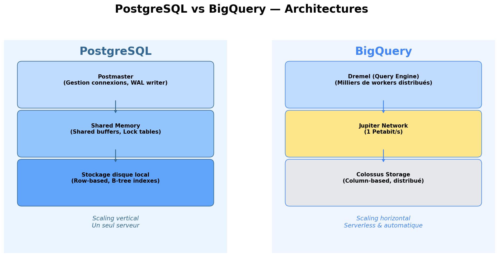
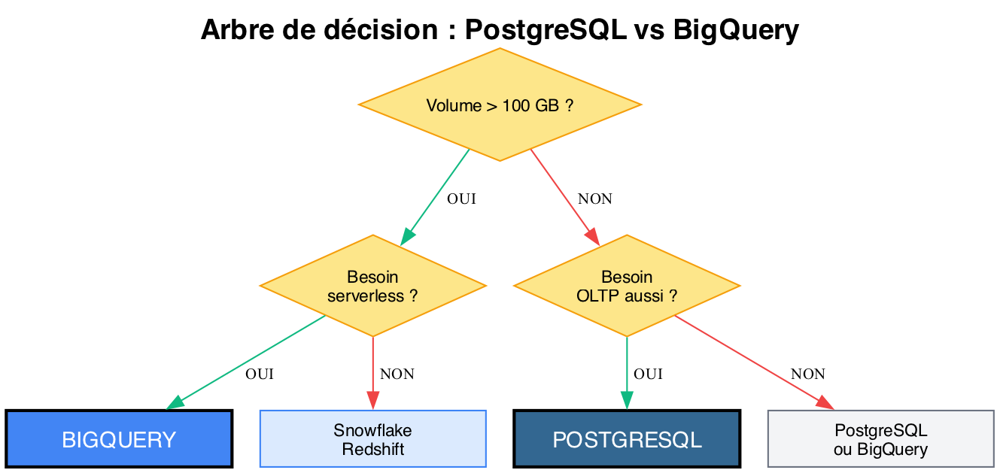

# Module 07 - PostgreSQL vs BigQuery

## Deux philosophies, deux mondes

PostgreSQL et BigQuery représentent deux approches fondamentalement différentes du Data Warehousing :



## Architecture

### PostgreSQL

> Voir le diagramme d'architecture comparé ci-dessus.

## Comparaison détaillée

### Infrastructure & Administration

| Aspect | PostgreSQL | BigQuery |
|--------|------------|----------|
| **Déploiement** | On-premise ou VM cloud | Serverless (SaaS) |
| **Administration** | DBA nécessaire | Aucune admin |
| **Mises à jour** | Manuelles | Automatiques |
| **Backup** | À configurer (pg_dump, WAL) | Automatique |
| **Haute disponibilité** | À configurer (replication) | Incluse |
| **Scaling** | Vertical (+ ressources serveur) | Horizontal (automatique) |
| **Installation** | `apt install postgresql` | Activation API dans GCP |

### Stockage & Performance

| Aspect | PostgreSQL | BigQuery |
|--------|------------|----------|
| **Stockage** | Row-based (lignes) | Column-based (colonnes) |
| **Volume optimal** | < 1 TB | 1 GB à Pétaoctets |
| **Compression** | TOAST (limitée) | Capacitor (excellent) |
| **Indexation** | B-tree, Hash, GIN, GiST | Partitionnement, Clustering |
| **Transactions** | ACID complet | Limité (DML) |
| **Concurrence** | MVCC (centaines d'utilisateurs) | Milliers de requêtes parallèles |

### Impact sur les requêtes analytiques

```sql
-- Requête : CA par catégorie sur 1 an
SELECT category, SUM(amount)
FROM sales
WHERE sale_date >= '2024-01-01'
GROUP BY category;
```

```
PostgreSQL (row-based, 10M lignes) :
┌─────────────────────────────────────────────────┐
│ Lecture : TOUTES les colonnes de chaque ligne    │
│ → sale_id, date, customer, product, amount, ... │
│ → Beaucoup de I/O inutile                        │
│ Temps : ~15 secondes                             │
└─────────────────────────────────────────────────┘

BigQuery (column-based, 10M lignes) :
┌─────────────────────────────────────────────────┐
│ Lecture : SEULEMENT category + amount + date     │
│ → Ignore toutes les autres colonnes              │
│ → I/O minimal + compression colonne              │
│ Temps : ~2 secondes                              │
└─────────────────────────────────────────────────┘
```

### SQL : Syntaxe comparée

#### Création de table

```sql
-- PostgreSQL
CREATE TABLE fact_sales (
    sale_id    SERIAL PRIMARY KEY,
    sale_date  DATE NOT NULL,
    customer_id INTEGER REFERENCES dim_customer(customer_id),
    amount     NUMERIC(10,2),
    category   VARCHAR(50)
);

CREATE INDEX idx_sales_date ON fact_sales(sale_date);
CREATE INDEX idx_sales_category ON fact_sales(category);
```

```sql
-- BigQuery
CREATE TABLE project.dataset.fact_sales (
    sale_id    INT64,
    sale_date  DATE,
    customer_id INT64,
    amount     FLOAT64,
    category   STRING
)
PARTITION BY sale_date
CLUSTER BY category;
-- Pas de PRIMARY KEY, pas de FOREIGN KEY, pas d'INDEX
```

#### Types de données

| Type | PostgreSQL | BigQuery |
|------|------------|----------|
| Entier | `INTEGER`, `BIGINT`, `SERIAL` | `INT64` |
| Décimal | `NUMERIC(10,2)`, `REAL` | `FLOAT64`, `NUMERIC` |
| Texte | `VARCHAR(n)`, `TEXT` | `STRING` |
| Date | `DATE` | `DATE` |
| Timestamp | `TIMESTAMP`, `TIMESTAMPTZ` | `TIMESTAMP` |
| Booléen | `BOOLEAN` | `BOOL` |
| JSON | `JSON`, `JSONB` | `JSON`, `STRUCT`, `ARRAY` |

#### Fonctions analytiques OLAP

```sql
-- PostgreSQL : fonctions fenêtres
SELECT
    region,
    month,
    revenue,
    SUM(revenue) OVER (PARTITION BY region ORDER BY month) as cumul_revenue,
    LAG(revenue) OVER (PARTITION BY region ORDER BY month) as prev_month,
    RANK() OVER (ORDER BY revenue DESC) as rank
FROM monthly_sales;

-- BigQuery : syntaxe quasi identique
SELECT
    region,
    month,
    revenue,
    SUM(revenue) OVER (PARTITION BY region ORDER BY month) as cumul_revenue,
    LAG(revenue) OVER (PARTITION BY region ORDER BY month) as prev_month,
    RANK() OVER (ORDER BY revenue DESC) as rank
FROM `project.dataset.monthly_sales`;
```

```sql
-- PostgreSQL : ROLLUP, CUBE, GROUPING SETS
SELECT region, category, SUM(amount)
FROM fact_sales
GROUP BY CUBE(region, category);

-- BigQuery : même syntaxe
SELECT region, category, SUM(amount)
FROM `project.dataset.fact_sales`
GROUP BY CUBE(region, category);
```

#### Différences de syntaxe notables

```sql
-- 1. Référence aux tables
-- PostgreSQL
SELECT * FROM schema_name.table_name;
-- BigQuery
SELECT * FROM `project.dataset.table_name`;

-- 2. Date truncation
-- PostgreSQL
SELECT DATE_TRUNC('month', sale_date) FROM sales;
-- BigQuery
SELECT DATE_TRUNC(sale_date, MONTH) FROM sales;

-- 3. Conversion de types
-- PostgreSQL
SELECT sale_date::TEXT, amount::INTEGER;
SELECT CAST(amount AS INTEGER);
-- BigQuery (pas de ::)
SELECT CAST(sale_date AS STRING), CAST(amount AS INT64);
SELECT SAFE_CAST(amount AS INT64);  -- retourne NULL si erreur

-- 4. String concatenation
-- PostgreSQL
SELECT first_name || ' ' || last_name FROM customers;
-- BigQuery
SELECT CONCAT(first_name, ' ', last_name) FROM customers;

-- 5. LIMIT avec OFFSET
-- PostgreSQL
SELECT * FROM sales ORDER BY amount DESC LIMIT 10 OFFSET 20;
-- BigQuery (identique)
SELECT * FROM sales ORDER BY amount DESC LIMIT 10 OFFSET 20;

-- 6. Expressions régulières
-- PostgreSQL
SELECT * FROM customers WHERE email ~ '^[a-z]+@gmail';
-- BigQuery
SELECT * FROM customers WHERE REGEXP_CONTAINS(email, r'^[a-z]+@gmail');

-- 7. Génération de séries
-- PostgreSQL
SELECT generate_series('2024-01-01'::date, '2024-12-31'::date, '1 month');
-- BigQuery
SELECT * FROM UNNEST(GENERATE_DATE_ARRAY('2024-01-01', '2024-12-31', INTERVAL 1 MONTH));
```

### Optimisation des performances

| Technique | PostgreSQL | BigQuery |
|-----------|------------|----------|
| **Index** | B-tree, Hash, GIN, GiST | Pas d'index |
| **Partitionnement** | `PARTITION BY RANGE/LIST/HASH` | `PARTITION BY` (date, integer range) |
| **Clustering** | `CLUSTER table USING index` (one-time) | `CLUSTER BY` (automatique) |
| **Matérialisation** | `MATERIALIZED VIEW` | `MATERIALIZED VIEW` |
| **Cache** | shared_buffers (RAM) | BI Engine (cache in-memory) |
| **Parallélisme** | Limité (workers configurables) | Natif (milliers de slots) |
| **EXPLAIN** | `EXPLAIN ANALYZE` | Console BigQuery (Execution Details) |
| **Vacuum** | `VACUUM ANALYZE` nécessaire | Automatique |

### Coûts

```
PostgreSQL :
┌─────────────────────────────────────────────────────────┐
│  Coût = Serveur (VM/hardware) + Stockage + DBA          │
│                                                          │
│  Exemple : VM 8 vCPU, 32 GB RAM, 500 GB SSD            │
│  AWS RDS : ~500€/mois                                   │
│  On-premise : coût hardware + maintenance               │
│                                                          │
│  → Coût fixe, prévisible                                │
│  → Payez même quand vous ne l'utilisez pas              │
└─────────────────────────────────────────────────────────┘

BigQuery :
┌─────────────────────────────────────────────────────────┐
│  Coût = Requêtes (TB scannés) + Stockage (GB/mois)     │
│                                                          │
│  On-demand : $5 / TB scanné                             │
│  Stockage : $0.02 / GB actif, $0.01 / GB long-term     │
│  Free tier : 1 TB requêtes + 10 GB stockage / mois     │
│                                                          │
│  → Coût variable, proportionnel à l'usage               │
│  → 0€ si pas de requêtes                                │
│  → Peut exploser si requêtes mal écrites (SELECT *)     │
└─────────────────────────────────────────────────────────┘
```

## Diagnostic et optimisation des requêtes

### PostgreSQL : EXPLAIN ANALYZE

`EXPLAIN ANALYZE` exécute réellement la requête et montre le plan d'exécution avec les temps mesurés :

```sql
EXPLAIN ANALYZE
SELECT
    p.category,
    SUM(f.amount) as total,
    COUNT(*) as nb
FROM fact_sales f
JOIN dim_product p ON f.product_key = p.product_key
WHERE f.sale_date >= '2024-01-01'
GROUP BY p.category
ORDER BY total DESC;
```

```
-- Résultat typique :
Sort  (cost=1250.43..1250.68 rows=100) (actual time=45.2..45.3 rows=12)
  Sort Key: sum(f.amount) DESC
  ->  HashAggregate  (cost=1245.00..1248.00 rows=100) (actual time=44.8..44.9 rows=12)
        Group Key: p.category
        ->  Hash Join  (cost=25.00..1120.00 rows=50000) (actual time=0.5..32.1 rows=48230)
              Hash Cond: (f.product_key = p.product_key)
              ->  Seq Scan on fact_sales f  (cost=0.00..950.00 rows=50000) (actual time=0.1..15.2 rows=48230)
                    Filter: (sale_date >= '2024-01-01')
                    Rows Removed by Filter: 51770
              ->  Hash  (cost=15.00..15.00 rows=500) (actual time=0.3..0.3 rows=500)
                    ->  Seq Scan on dim_product p  (cost=0.00..15.00 rows=500)
Planning Time: 0.2 ms
Execution Time: 45.5 ms
```

**Ce qu'il faut regarder :**

| Indicateur | Bon signe | Mauvais signe |
|-----------|-----------|---------------|
| `Seq Scan` sur grande table | - | Table > 10K lignes sans index |
| `Index Scan` | Utilise un index | - |
| `Rows Removed by Filter` | Faible ratio | >> rows retournées |
| `actual time` | Proche du `cost` estimé | Très supérieur |
| `Hash Join` | Tables bien dimensionnées | Mémoire insuffisante → Nested Loop |

### Stratégies d'indexation PostgreSQL

```sql
-- Index B-tree : le plus courant (égalité, range, ORDER BY)
CREATE INDEX idx_sales_date ON fact_sales(sale_date);
CREATE INDEX idx_sales_product ON fact_sales(product_key);

-- Index composite : pour les requêtes multi-colonnes fréquentes
CREATE INDEX idx_sales_date_product ON fact_sales(sale_date, product_key);
-- L'ORDRE compte ! Mettez la colonne la plus sélective en premier

-- Index partiel : n'indexe qu'un sous-ensemble
CREATE INDEX idx_sales_recent ON fact_sales(sale_date)
WHERE sale_date >= '2024-01-01';
-- Plus petit, plus rapide, utile si vous requêtez surtout les données récentes

-- Vérifier l'utilisation des index
SELECT
    indexrelname as index_name,
    idx_scan as times_used,
    idx_tup_read as rows_read
FROM pg_stat_user_indexes
WHERE schemaname = 'public'
ORDER BY idx_scan DESC;
```

### BigQuery : Execution Details

BigQuery n'a pas d'`EXPLAIN`, mais fournit des métriques post-exécution dans la console :

```sql
-- Vérifier les bytes scannés AVANT d'exécuter (dry run)
-- Dans la console BigQuery : le coin supérieur droit affiche
-- "This query will process X GB when run"

-- Forcer l'utilisation des partitions
SELECT SUM(amount)
FROM `project.dataset.fact_sales`
WHERE sale_date = '2024-06-15'  -- Scanne 1 partition
-- vs
-- WHERE CAST(sale_date AS STRING) LIKE '2024-06%'  -- Scanne TOUT (le filtre empêche le pruning)
```

**Optimisations BigQuery :**

| Technique | Impact | Exemple |
|-----------|--------|---------|
| **Partitionnement** | Réduit les données scannées | `PARTITION BY DATE(sale_date)` |
| **Clustering** | Tri physique des données | `CLUSTER BY category, region` |
| **Materialized Views** | Cache de résultats agrégés | `CREATE MATERIALIZED VIEW ...` |
| **BI Engine** | Cache in-memory pour BI | Activation dans la console |
| **Approximate functions** | Résultats approchés ultra-rapides | `APPROX_COUNT_DISTINCT()` |

## Quand utiliser quoi ?

### Choisir PostgreSQL quand :

- Volume < 100 GB de données analytiques
- Besoin de transactions ACID (OLTP + OLAP mixte)
- Budget limité (open source, pas de coût cloud)
- Équipe familière avec l'administration PostgreSQL
- Données sensibles devant rester on-premise
- Prototypage rapide avant migration cloud
- Besoin de `FOREIGN KEY`, contraintes d'intégrité strictes

### Choisir BigQuery quand :

- Volume > 100 GB, potentiellement pétaoctets
- Charges analytiques pures (OLAP uniquement)
- Besoin de scalabilité illimitée
- Pas de DBA dans l'équipe
- Écosystème GCP déjà en place
- Besoin de ML intégré (BigQuery ML)
- Données partagées entre équipes (IAM, Data Sharing)

### Arbre de décision



## Stratégie hybride : le meilleur des deux mondes

En entreprise, il est courant de combiner les deux :

```
┌──────────────┐                    ┌──────────────────┐
│  PostgreSQL  │                    │    BigQuery       │
│   (OLTP)     │──── ETL/CDC ──────►│   (OLAP / DW)    │
│              │     (nuit ou       │                   │
│ Application  │      streaming)    │  Analyse, BI,    │
│ transactions │                    │  ML, Reporting   │
└──────────────┘                    └──────────────────┘
```

- **PostgreSQL** gère les opérations quotidiennes (commandes, paiements, stocks)
- **BigQuery** reçoit les données via ETL pour l'analytique
- Chaque outil est utilisé pour ce qu'il fait le mieux

## Points clés à retenir

- **PostgreSQL** : polyvalent, row-based, ACID, open source, scaling vertical
- **BigQuery** : analytique pur, column-based, serverless, scaling illimité
- Le choix dépend du **volume**, du **type de requêtes** et de l'**équipe**
- Les deux partagent une syntaxe SQL proche (fenêtres, ROLLUP, CUBE)
- En production, on les combine souvent (OLTP + OLAP)
- PostgreSQL est excellent pour **apprendre** les concepts DW avant de passer au cloud
- **EXPLAIN ANALYZE** (PostgreSQL) et **Execution Details** (BigQuery) sont indispensables pour diagnostiquer les performances
- **Indexation** (PG) et **Partitionnement/Clustering** (BQ) sont les leviers principaux d'optimisation

---

**Prochain module :** [08 - Architecture Medallion](./08-medallion.md)

[Module précédent](./06-technologies-cloud.md) | [Retour au sommaire](./README.md)
