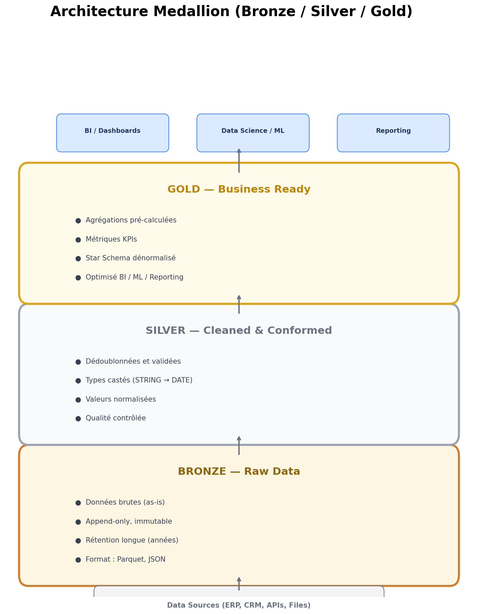
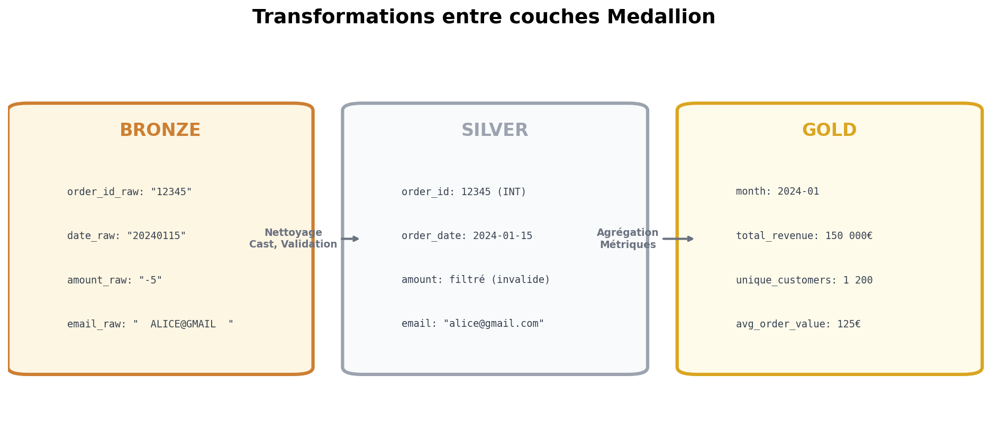

# Module 08 - Architecture Medallion

## Concept

L'architecture **Medallion** (Bronze/Silver/Gold) est un pattern de design pour organiser les données en couches progressives de qualité.



## Pourquoi cette architecture ?

### Problèmes résolus

| Problème | Solution Medallion |
|----------|-------------------|
| Données corrompues | Bronze conserve l'original |
| Traçabilité | Lineage clair entre couches |
| Qualité variable | Silver applique les règles |
| Performance BI | Gold optimisé pour requêtes |
| Coût | Bronze stockage économique |

### Bénéfices

- **Reproductibilité** : Reprocesser depuis Bronze
- **Debuggabilité** : Identifier où l'erreur survient
- **Gouvernance** : Permissions par couche
- **Agilité** : Ajouter de nouvelles transformations

## Bronze Layer (Raw)

### Objectif

Ingestion des données **brutes**, sans transformation, pour archivage historique complet.

### Caractéristiques

> Voir le diagramme Medallion ci-dessus pour les détails de chaque couche.

### Exemples d'implémentation

**BigQuery**
```sql
-- Table Bronze
CREATE TABLE bronze.raw_sales (
    ingestion_timestamp TIMESTAMP DEFAULT CURRENT_TIMESTAMP(),
    source_system STRING,
    raw_data STRING  -- JSON brut
)
PARTITION BY DATE(ingestion_timestamp);

-- Ou table structurée avec colonnes sources
CREATE TABLE bronze.sales_raw (
    ingestion_timestamp TIMESTAMP,
    source_file STRING,
    order_id_raw STRING,
    amount_raw STRING,  -- Garder le type string original
    date_raw STRING,
    customer_email_raw STRING
);
```

**Snowflake**
```sql
-- Table Bronze
CREATE TABLE bronze.sales_raw (
    _ingested_at TIMESTAMP_NTZ DEFAULT CURRENT_TIMESTAMP(),
    _source_file VARCHAR,
    raw_json VARIANT  -- Semi-structured
);

-- Chargement depuis Stage
COPY INTO bronze.sales_raw
FROM @my_stage/sales/
FILE_FORMAT = (TYPE = JSON);
```

## Silver Layer (Cleaned)

### Objectif

Données **nettoyées**, validées, dédupliquées et standardisées.

### Caractéristiques



### Transformations typiques

| Transformation | Avant (Bronze) | Après (Silver) |
|----------------|----------------|----------------|
| Cast type | `"2024-01-15"` | `2024-01-15 (DATE)` |
| Normalisation | `"  PARIS  "` | `"Paris"` |
| Dédoublonnage | 3 lignes id=123 | 1 ligne id=123 |
| Nettoyage | `amount = "-5"` | Filtré ou corrigé |
| Enrichissement | `country_code = "FR"` | + `country_name = "France"` |

### Exemple BigQuery

```sql
-- Silver : Transformation depuis Bronze
CREATE OR REPLACE TABLE silver.sales_cleaned AS
SELECT DISTINCT
    -- Clés
    CAST(order_id_raw AS INT64) as order_id,

    -- Dates
    PARSE_DATE('%Y%m%d', date_raw) as order_date,

    -- Montants
    SAFE_CAST(amount_raw AS FLOAT64) as amount,

    -- Normalisation
    LOWER(TRIM(customer_email_raw)) as customer_email,
    UPPER(SUBSTR(customer_email_raw,
        STRPOS(customer_email_raw, '@') + 1)) as email_domain,

    -- Metadata
    CURRENT_TIMESTAMP() as _processed_at

FROM bronze.sales_raw
WHERE
    order_id_raw IS NOT NULL
    AND SAFE_CAST(amount_raw AS FLOAT64) > 0;
```

### Data Quality Checks

```sql
-- Assertions de qualité
SELECT
    COUNT(*) as total_rows,
    COUNT(DISTINCT order_id) as unique_orders,
    SUM(CASE WHEN amount IS NULL THEN 1 ELSE 0 END) as null_amounts,
    SUM(CASE WHEN amount < 0 THEN 1 ELSE 0 END) as negative_amounts,
    MIN(order_date) as min_date,
    MAX(order_date) as max_date
FROM silver.sales_cleaned;

-- Alerter si anomalie
-- null_amounts > 0 ou negative_amounts > 0 → Investigation
```

## Gold Layer (Business)

### Objectif

Données **agrégées** et optimisées pour la consommation business (BI, ML, Reporting).

### Caractéristiques

> Voir les diagrammes Medallion ci-dessus pour les détails de la couche Gold.

### Exemple BigQuery

```sql
-- Gold : Métriques par région et mois
CREATE OR REPLACE TABLE gold.sales_by_region_monthly AS
SELECT
    -- Dimensions
    DATE_TRUNC(order_date, MONTH) as month,
    c.region,
    c.segment,

    -- Métriques agrégées
    COUNT(DISTINCT s.order_id) as order_count,
    COUNT(DISTINCT s.customer_email) as unique_customers,
    SUM(s.amount) as total_revenue,
    AVG(s.amount) as avg_order_value,

    -- Métriques calculées
    SAFE_DIVIDE(SUM(s.amount), COUNT(DISTINCT s.customer_email))
        as revenue_per_customer,

    -- Metadata
    CURRENT_TIMESTAMP() as _refreshed_at

FROM silver.sales_cleaned s
LEFT JOIN silver.customers c ON s.customer_email = c.email
GROUP BY 1, 2, 3;

-- Gold : Vue Customer 360
CREATE OR REPLACE TABLE gold.customer_360 AS
SELECT
    customer_email,
    MIN(order_date) as first_order_date,
    MAX(order_date) as last_order_date,
    COUNT(*) as total_orders,
    SUM(amount) as lifetime_value,
    AVG(amount) as avg_order_value,
    DATE_DIFF(CURRENT_DATE(), MAX(order_date), DAY) as days_since_last_order,
    CASE
        WHEN DATE_DIFF(CURRENT_DATE(), MAX(order_date), DAY) > 90 THEN 'At Risk'
        WHEN DATE_DIFF(CURRENT_DATE(), MAX(order_date), DAY) > 30 THEN 'Cooling'
        ELSE 'Active'
    END as customer_status
FROM silver.sales_cleaned
GROUP BY customer_email;
```

## Implémentation par plateforme

### BigQuery

```
project_id
├── dataset_bronze      -- raw_*
├── dataset_silver      -- cleaned_*, validated_*
└── dataset_gold        -- dm_*, fact_*, dim_*, agg_*
```

### Snowflake

```
database
├── schema_bronze       -- RAW_*
├── schema_silver       -- CLEAN_*
└── schema_gold         -- DIM_*, FACT_*, AGG_*
```

### Databricks / Fabric

```
Workspace
├── Lakehouse_Bronze
├── Lakehouse_Silver
└── Lakehouse_Gold
```

## Orchestration des transformations

### Option 1 : Scheduled Queries (BigQuery)

```sql
-- Requête planifiée : Bronze → Silver (chaque heure)
-- Configuration : Schedule every 1 hour

INSERT INTO silver.sales_cleaned
SELECT DISTINCT ...
FROM bronze.sales_raw
WHERE ingestion_timestamp >
    (SELECT MAX(_processed_at) FROM silver.sales_cleaned);
```

### Option 2 : Stored Procedures

```sql
-- BigQuery : Procédure stockée
CREATE OR REPLACE PROCEDURE silver.sp_transform_sales()
BEGIN
    -- Transformation Bronze → Silver
    CREATE OR REPLACE TABLE silver.sales_cleaned AS
    SELECT ...
    FROM bronze.sales_raw;

    -- Log
    INSERT INTO logs.pipeline_runs VALUES (
        CURRENT_TIMESTAMP(),
        'silver.sp_transform_sales',
        'SUCCESS'
    );
END;

-- Appel
CALL silver.sp_transform_sales();
```

### Option 3 : Dataform / dbt

```sql
-- models/silver/sales_cleaned.sql (dbt/Dataform)
{{ config(
    materialized='table',
    partition_by={'field': 'order_date', 'data_type': 'date'}
) }}

SELECT DISTINCT
    CAST(order_id_raw AS INT64) as order_id,
    PARSE_DATE('%Y%m%d', date_raw) as order_date,
    SAFE_CAST(amount_raw AS FLOAT64) as amount
FROM {{ ref('bronze_sales_raw') }}
WHERE order_id_raw IS NOT NULL
```

## Data Quality Framework

### Principes de qualité par couche

| Couche | Responsabilité qualité | Outils |
|--------|----------------------|--------|
| **Bronze** | Vérifier que les données arrivent (freshness, completeness) | Monitoring d'ingestion |
| **Silver** | Valider types, unicité, plages, relations | dbt tests, Great Expectations |
| **Gold** | Vérifier cohérence des agrégations et KPIs | Tests de réconciliation |

### Tests avec dbt

```yaml
# models/silver/schema.yml
version: 2

models:
  - name: sales_cleaned
    description: "Ventes nettoyées et validées"
    columns:
      - name: order_id
        tests:
          - unique          # Pas de doublons
          - not_null        # Jamais NULL

      - name: amount
        tests:
          - not_null
          - dbt_utils.expression_is_true:
              expression: "> 0"   # Toujours positif

      - name: order_date
        tests:
          - not_null
          - dbt_utils.recency:
              datepart: day
              interval: 2     # Données de moins de 2 jours

      - name: customer_email
        tests:
          - not_null
          - dbt_utils.expression_is_true:
              expression: "LIKE '%@%.%'"  # Format email basique
```

### Tests avec Great Expectations

```python
# Exemple de suite d'expectations pour la couche Silver
import great_expectations as gx

context = gx.get_context()
validator = context.sources.pandas_default.read_csv("silver_sales.csv")

# Vérifications
validator.expect_column_values_to_not_be_null("order_id")
validator.expect_column_values_to_be_unique("order_id")
validator.expect_column_values_to_be_between("amount", min_value=0, max_value=1_000_000)
validator.expect_column_values_to_match_regex("customer_email", r"^.+@.+\..+$")
validator.expect_table_row_count_to_be_between(min_value=1000)  # Au moins 1000 lignes

# Validation
results = validator.validate()
if not results.success:
    raise Exception("Data quality check failed!")
```

### Seuils d'alerte

```sql
-- Monitoring de freshness (Bronze)
SELECT
    TIMESTAMP_DIFF(CURRENT_TIMESTAMP(), MAX(ingestion_timestamp), HOUR) as hours_since_last_ingestion
FROM bronze.sales_raw;
-- Alerte si > 2 heures

-- Taux de rejet (Silver)
SELECT
    ROUND(100.0 * COUNTIF(amount IS NULL OR amount <= 0) / COUNT(*), 2) as reject_rate_pct
FROM bronze.sales_raw;
-- Alerte si > 5% (seuil métier à définir)

-- Réconciliation (Gold vs Silver)
SELECT
    ABS(
        (SELECT SUM(amount) FROM silver.sales_cleaned WHERE order_date >= '2024-01-01') -
        (SELECT SUM(total_revenue) FROM gold.sales_monthly WHERE month >= '2024-01-01')
    ) as reconciliation_diff;
-- Attendu : < 0.01
```

## Gestion des erreurs et cas limites

### Late-arriving facts (faits tardifs)

Des transactions peuvent arriver **après** le traitement de la couche Silver/Gold :

```sql
-- Stratégie : INSERT incrémental avec fenêtre de re-traitement
INSERT INTO silver.sales_cleaned
SELECT DISTINCT
    CAST(order_id_raw AS INT64) as order_id,
    PARSE_DATE('%Y%m%d', date_raw) as order_date,
    SAFE_CAST(amount_raw AS FLOAT64) as amount,
    LOWER(TRIM(customer_email_raw)) as customer_email,
    CURRENT_TIMESTAMP() as _processed_at
FROM bronze.sales_raw
WHERE ingestion_timestamp > TIMESTAMP_SUB(
    (SELECT MAX(_processed_at) FROM silver.sales_cleaned),
    INTERVAL 24 HOUR  -- Re-traiter les dernières 24h pour capturer les retards
)
AND order_id_raw IS NOT NULL
AND SAFE_CAST(amount_raw AS FLOAT64) > 0;

-- Dédouper après l'insert (les doublons peuvent apparaître)
CREATE OR REPLACE TABLE silver.sales_cleaned AS
SELECT * EXCEPT(row_num)
FROM (
    SELECT *, ROW_NUMBER() OVER (PARTITION BY order_id ORDER BY _processed_at DESC) as row_num
    FROM silver.sales_cleaned
)
WHERE row_num = 1;
```

### Données corrompues

```sql
-- Quarantaine : isoler les lignes en erreur pour investigation
CREATE TABLE silver.sales_quarantine AS
SELECT
    *,
    CASE
        WHEN order_id_raw IS NULL THEN 'missing_order_id'
        WHEN SAFE_CAST(amount_raw AS FLOAT64) IS NULL THEN 'invalid_amount'
        WHEN SAFE_CAST(amount_raw AS FLOAT64) <= 0 THEN 'negative_amount'
        WHEN PARSE_DATE('%Y%m%d', date_raw) IS NULL THEN 'invalid_date'
        ELSE 'unknown_error'
    END as quarantine_reason,
    CURRENT_TIMESTAMP() as _quarantined_at
FROM bronze.sales_raw
WHERE
    order_id_raw IS NULL
    OR SAFE_CAST(amount_raw AS FLOAT64) IS NULL
    OR SAFE_CAST(amount_raw AS FLOAT64) <= 0;

-- Monitoring : nombre de lignes en quarantaine par jour
SELECT
    DATE(_quarantined_at) as day,
    quarantine_reason,
    COUNT(*) as count
FROM silver.sales_quarantine
GROUP BY 1, 2
ORDER BY 1 DESC, 3 DESC;
```

### Rollback : reprocesser depuis Bronze

C'est l'avantage principal de l'architecture Medallion — Bronze est immutable :

```sql
-- Étape 1 : Supprimer les données Silver/Gold corrompues
TRUNCATE TABLE silver.sales_cleaned;
TRUNCATE TABLE gold.sales_by_region_monthly;

-- Étape 2 : Reprocesser depuis Bronze (source de vérité)
CREATE OR REPLACE TABLE silver.sales_cleaned AS
SELECT DISTINCT ... FROM bronze.sales_raw WHERE ...;

-- Étape 3 : Recalculer Gold
CREATE OR REPLACE TABLE gold.sales_by_region_monthly AS
SELECT ... FROM silver.sales_cleaned ...;

-- Étape 4 : Vérifier la cohérence
SELECT COUNT(*) as silver_rows FROM silver.sales_cleaned;
SELECT SUM(total_revenue) as gold_total FROM gold.sales_by_region_monthly;
```

## Gouvernance et metadata

### Catalogue de données

Documenter chaque couche est essentiel pour la maintenabilité :

| Élément | Bronze | Silver | Gold |
|---------|--------|--------|------|
| **Owner** | Data Engineering | Data Engineering | Data Analytics |
| **SLA Freshness** | < 1h | < 2h | < 4h |
| **Rétention** | 7 ans | 2 ans | 1 an |
| **Accès** | Ingestion pipeline only | Data Engineers + Analysts | Tous (BI, ML, Reporting) |
| **PII** | Brut (non masqué) | Pseudonymisé | Agrégé (pas de PII) |

### Lineage (traçabilité)

```
Source ERP → Bronze.sales_raw → Silver.sales_cleaned → Gold.sales_monthly
                                                     → Gold.customer_360

-- En dbt, le lineage est automatique via {{ ref() }}
-- En BigQuery, INFORMATION_SCHEMA.JOBS expose le lineage
SELECT
    destination_table.table_id,
    referenced_tables
FROM `region-eu`.INFORMATION_SCHEMA.JOBS
WHERE creation_time > TIMESTAMP_SUB(CURRENT_TIMESTAMP(), INTERVAL 7 DAY);
```

### RGPD et données personnelles

| Couche | Traitement RGPD |
|--------|----------------|
| **Bronze** | Données brutes — accès restreint, chiffrement au repos |
| **Silver** | Pseudonymisation (hash des emails, masquage des noms) |
| **Gold** | Agrégation — plus de données personnelles identifiables |

```sql
-- Pseudonymisation en Silver
SELECT
    order_id,
    SHA256(customer_email) as customer_hash,  -- Pseudonymisé
    REGEXP_REPLACE(customer_email, r'^(.{2}).*(@.*)$', r'\1***\2') as email_masked,
    amount,
    order_date
FROM bronze.sales_raw;
```

## Bonnes pratiques

### Nommage

| Couche | Convention | Exemple |
|--------|------------|---------|
| Bronze | `raw_*`, `bronze_*` | `raw_sales_2024` |
| Silver | `clean_*`, `validated_*` | `clean_orders` |
| Gold | `dm_*`, `agg_*`, `fact_*` | `agg_sales_daily` |

### Metadata

Toujours inclure :
```sql
-- Bronze
_ingested_at TIMESTAMP
_source_file STRING
_source_system STRING

-- Silver
_processed_at TIMESTAMP
_data_quality_score FLOAT64

-- Gold
_refreshed_at TIMESTAMP
_grain STRING  -- 'daily', 'monthly'
```

### Tests

```sql
-- Test Bronze : données arrivent
SELECT COUNT(*) FROM bronze.sales_raw
WHERE DATE(ingestion_timestamp) = CURRENT_DATE();
-- Attendu : > 0

-- Test Silver : pas de doublons
SELECT order_id, COUNT(*)
FROM silver.sales_cleaned
GROUP BY 1 HAVING COUNT(*) > 1;
-- Attendu : 0 lignes

-- Test Gold : cohérence
SELECT ABS(
    (SELECT SUM(amount) FROM silver.sales_cleaned) -
    (SELECT SUM(total_revenue) FROM gold.sales_daily)
);
-- Attendu : < 0.01 (arrondi)
```

## Points clés à retenir

- **Bronze** = données brutes, immutables, archivage long terme
- **Silver** = nettoyées, validées, dédupliquées, types corrects
- **Gold** = agrégées, dénormalisées, prêtes pour BI/ML
- Chaque couche a un objectif distinct
- **Qualité** : tester à chaque couche (dbt tests, Great Expectations, réconciliation)
- **Erreurs** : quarantaine des données corrompues, re-traitement depuis Bronze
- **Late-arriving facts** : fenêtre de re-traitement + dédoublonnage
- **Gouvernance** : documenter owners, SLA, rétention, accès par couche
- **RGPD** : pseudonymiser en Silver, agréger en Gold
- Automatiser les transformations (dbt, Dataform, Procedures)

---

[Module précédent](./07-postgresql-vs-bigquery.md) | [Retour au sommaire](./README.md)

## Pour aller plus loin

- [Brief pratique : BigQuery Medallion](../../../99-Brief/BigQuery-Medallion/)
- [Cours GCP BigQuery](../../../04-Cloud-Platforms/GCP/BigQuery/)
